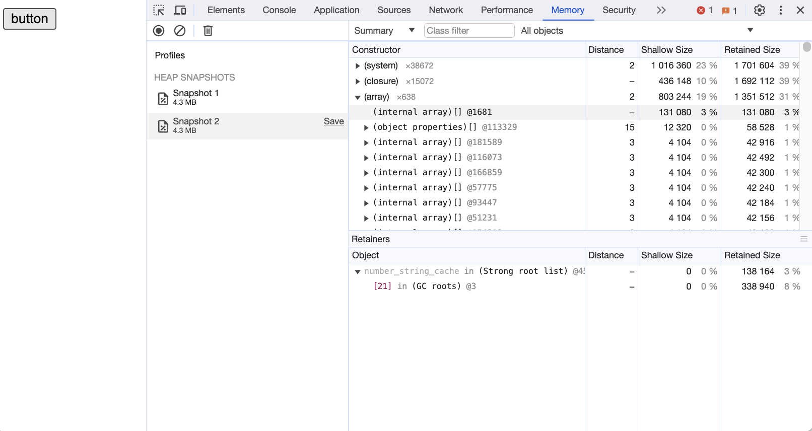
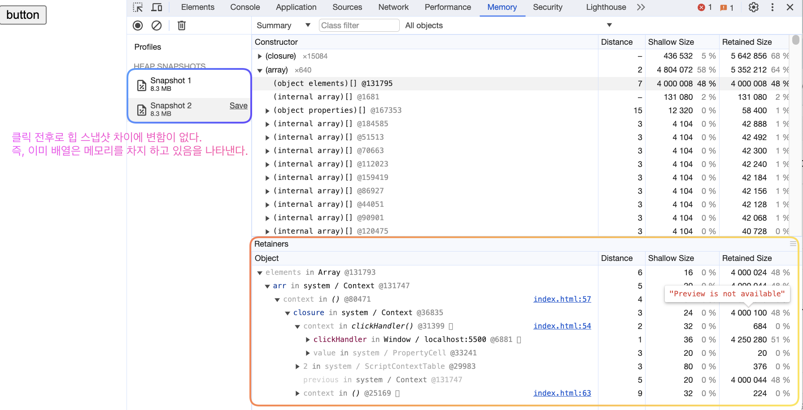

# 4. 클로저

리액트 클래스형 컴포넌트의 대한 이해가 자바스크립트의 클래스, 프로토타입, `this`에 달려있다면, 함수형 컴포넌트에 대한 이해는 클로저에 달려있다.
함수형 컴포넌트의 구조와 작동 방식, 훅의 원리, 의존성 배열 등 함수형 컴포넌트의 대부분의 기술이 모두 클로저에 의존하고 있기 때문에 클로저에 대한 이해는 필수다.

## 4.1 클로저의 정의

[MDN에서는 클로저](https://developer.mozilla.org/ko/docs/Web/JavaScript/Closures)를 "주변 상태(어휘적 환경)에 대한 참조와 함께 묶인(포함된) 함수의 조합. 즉, 클로저는 내부 함수에서 외부 함수의 범위에 대한 접근을 제공하며, 함수 생성 시 함수가 생성될 때마다 생성"이라고 정의한다.

"주변 상태(어휘적 환경)에 대한 참조와 함께 묶인(포함된) 함수"에서 "어휘적 환경"은 변수가 코드 내부에서 어디서 선언되었는지 말하는 것이다. 이는 호출되는 방식에 따라 동적으로 결정되는 `this`와는 다르게 코드가 작성되는 순간에 정적으로 결정된다. 클로저는 이러한 "어휘적 환경"을 조합하는 함수다.

<details>
<summary>"어휘적 환경" 예시</summary>

```js
function outer() {
  const first = "closure";

  function inner() {
    const second = "is";
    console.log(`${first} ${second} awesome!`);
  }
  inner(); // closure is awesome!
}

outer();
```

> `outer` 함수 내부에 `inner` 함수가 있고, `inner` 함수 내부에서 변수 `second`를 선언한 뒤, 자신의 함수 외부에 있는 `first`와 `second`를 결합해 문장을 출력한다.
> 함수가 중첩이 되어있는 상황에서 변수의 범위, `first`의 유효 범위는 `outer` 함수 전체이고, `second`의 유효 범위는 `inner` 함수 전체다. `inner` 함수는 `outer` 함수 내부에 선언되어 있어 `first`에 접근할 수 있음을 알 수 있다.

</details>

## 4.2 변수의 유효 범위, 스코프

변수의 유효 범위에 따라 "어휘적 환경"이 결정된다고 했다. 이러한 변수의 유효 범위를 스코프라고 한다.

### 4.2.1 전역 스코프

전역 레벨에 선언하는 것을 전역 스코프(global scope)라고 한다. 전역 스코프에 선언된 변수는 어디서든지 참조할 수 있다.
브라우저 환경에서 전역 객체는 `window`이고, Node.js 환경에서는 `global`이며, 해당 객체에 전역 레벨에서 선언된 변수가 바인딩된다.

<details>
<summary>전역 스코프 예시</summary>

```js
var globalVariable = "global var";

function greet() {
  console.log(globalVariable);
}

console.log(globalVariable); // global var
greet(); // global var
console.log(globalVariable === window.globalVariable); // true
```

</details>

### 4.2.2 함수 스코프

자바스크립트는 기본적으로 함수 레벨 스코프(function-level scope)를 따른다. 즉, `{}` 블록이 스코프 범위를 결정하지 않는다는 것이다.

```js
function greet() {
  var message = "Hello";
  console.log(message);
}

greet(); // Hello

// 함수 블록 내부에서 선언된 변수 `message`는 함수 외부에서 접근할 수 없다.
console.log(message); // Uncaught ReferenceError: message is not defined
```

<details>
<summary>블록 스코프 예시</summary>

```js
if (true) {
  var globalVariable = "global var";
}

console.log(globalVariable); // global var
console.log(globalVariable === window.globalVariable); // true
```

`globalVariable` 변수는 `{}` 내부에서 선언되었음에도, `{}` 외부에서도 접근이 가능하다. 즉, 자바스크립트에서는 `{}` 블록이 스코프를 결정하지 않는다는 의미다.

</details>

<details>
<summary>중첩된 함수 스코프 예시</summary>

```js
var a = 10;

function foo() {
  var a = 100;
  console.log(a);

  function bar() {
    var a = 1000;
    console.log(a);
  }
  bar();
}

foo(); // 100, 1000
console.log(a); // 10
```

함수 스코프가 중첩되어 있다면, 일단 가장 가까운 스코프에 있는 변수를 참조한다.

</details>

## 4.3 클로저의 활용

```js
function outer() {
  var greeting = "Hello";

  function inner() {
    console.log(greeting);
  }

  return inner;
}

const innerFunc = outer();
innerFunc(); // Hello
```

`outer` 함수는 `inner` 함수를 반환하하며 종료된다. 반환함 함수에는 `greeting`이라는 변수가 존재하지 않지만, 해당 함수가 선언된 "어휘적 환경"에는 `greeting` 변수가 존재한다. 따라서 `inner` 함수는 `outer` 함수의 "어휘적 환경"을 기억하며 `"Hello"`를 출력한다.

### 4.3.1 클로저로 변경

전역 스코프는 원하는 값을 어디서든 참조할 수 있다. 즉, 누구든 접근할 수 있고 수정할 수 있으며 의도치 않게 값이 변경되어 버릴 수 있다는 것을 의미한다.

```js
var num = 0;

function increase() {
  num++;
}
```

`num` 변수는 전역 스코프에 선언되어 있기 때문에 누구나 수정할 수 있다. 이를 방지하기 위해 클로저를 사용할 수 있다.

```js
function Counter() {
  var num = 0;

  return {
    increase: function () {
      return ++num;
    },
    decrease: function () {
      return --num;
    },
    counter: function () {
      return num;
    },
  };
}

const counter = Counter();

console.log(counter.increase()); // 1
console.log(counter.increase()); // 2
console.log(counter.decrease()); // 1
console.log(counter.counter()); // 1
```

클로저로 변경하면, `conter` 변수를 직접적으로 노출하지 않음으로써 사용자가 직접 수정하는 것을 막음과 접근하는 경우를 제한해 로그를 남기는 등 부차적인 작업도 수행할 수 있다.
또한 `counter` 변수의 업데이트를 `increase`와 `decrease` 함수로 제한함으로써, `counter` 변수의 값이 의도치 않게 변경되는 것을 방지할 수 있다.

이처럼 클로저를 활용하면 전역 스코프의 남용을 방지하고, 개발자가 원하는 정보만 개발자가 원하는 방향으로 노출시킬 수 있다.

### 4.3.2 리액트에서의 클로저

리액트에서 클로저의 원리를 사용하고 있는 대표적인 것은 `useState` 훅이다.

```jsx
function Counter() {
  const [count, setCount] = useState(0);

  function handleClick() {
    // useState 호출은 위에서 끝났지만, useState는 계속 내부의 최신값(prev)을 알고 있으며 이는 클로저를 활용했기에 가능하다.
    setCount(prev => prev + 1);
  }

  return (
    // ...
  );
}
```

외부 함수(`useState`)가 반환한 내부 함수(`setState`)는 외부 함수의 호출이 끝났음에도 자신이 선언된 외부 함수가 선언된 환경(`state`가 저장되어있는 공간)을 기억하고 있기 때문에 계속해서 `state` 값을 사용할 수 있는 것이다.

## 4.4 주의점

```js
for (var i = 0; i < 5; i++) {
  setTimeout(function () {
    console.log(i);
  }, i * 1000);
}
```

0부터 시작해 1초 간격으로 `console.log`로 0, 1, 2, 3, 4를 차례로 출력하는 코드다. 하지만 실제로는 0, 1, 2, 3, 4초 뒤에 5만 출력된다.
이는 `i`(`var`는 함수 스코프를 따르기 때문에, `for` 문이 스코프를 결정하지 않는다.)가 전역 스코프에 선언되어 있기 때문에, `for` 문을 순회한 이후, 태스크 큐에 있는 setTimeout을 실행하려고 했을 때, 이미 `i`의 값이 5로 업데이트 되어 있기 때문이다.

<details>
<summary>해결하기 위한 첫 번째 방법: 블록 레벨 스코프를 갖는 let으로 수정</summary>

```js
for (let i = 0; i < 5; i++) {
  setTimeout(function () {
    console.log(i);
  }, i * 1000);
}
```

</details>
<details>
<summary>해결하기 위한 두 번째 방법: 클로저</summary>

```js
for (var 1 = 0; i < 5; i++) {
  setTimeout(
    (function (sec) {
      return function () {
        console.log(sec);
      };
    })(i),
    i * 1000
  );
```

`for` 문 내부에서 즉시 실행 익명 함수를 선언해 `i`를 인수로 받으며, 함수 내부에서는 이를 `sec`라는 인수에 저장해 두었다가 `setTimeout`의 콜백 함수에 넘긴다.
이렇게 `setTimeout`의 콜백 함수가 바라보는 클로저는 즉시 실행 함수가 되는데, 이 즉시 실행 익명 함수가 각 `for` 문마다 생성되고 실행되기를 반복한다. 그리고 각각의 함수는 고유한 스코프, 즉 고유한 `sec`를 가지게 된다.

</details>

<br/>

클로저를 사용할 때 주의할 점은, 사용하는데 비용이 든다는 점이다. 클로저는 생성될 때마다 그 선언적 환경을 기억해야 하므로 추가적인 비용이 발생한다.

<details>
<summary>일반 함수 vs 클로저</summary>

**일반 함수**

```js
const button = document.querySelector(".button");

function clickHandler() {
  const arr = Array.from({ length: 1000000 }, (_, i) => i + 1);
  console.log(arr.length);
}

button.addEventListener("click", clickHandler);
```


_메모리의 전체 크기가 작고, 실행 전후로 큰 차이가 없다._

**클로저**

```js
const button = document.querySelector(".button");

function clickHandler() {
  const arr = Array.from({ length: 1000000 }, (_, i) => i + 1);

  return function () {
    console.log(arr.length);
  };
}

const closure = clickHandler();
button.addEventListener("click", function () {
  closure();
});
```


_메모리의 일반 함수에 비해 크며, 배열을 어디서 사용하는지 상관 없이 해당 내용을 기억해 둬야 하기 때문에 메모리에 배열이 올라가 있다._

즉 외부 함수를 기억하고 이를 내부 함수에 가져다 쓰는 메커니즘인 클로저는 성능에 영향을 미친다.
클로저에 필요한 작업만 남겨두지 않는다면 메모리를 불필요하게 잡아먹는 결과를 야기할 수 있으며 클로저 사용을 적절한 스코프로 가둬두지 않으면 성능에 악영향을 미친다.

클로저의 비용은 공짜가 아니므로 사용할 때 주의해야 한다.

</details>

## 4.5 요약

클로저는 함수형 프로그래밍의 중요한 개념이며, 부수 효과가 없고 순수해야 한다는 목적 달성을 위해 적극적으로 사용되는 개념이다.
하지만 클로저는 비용이 발생하기 때문에 사용에 주의해야 한다.
