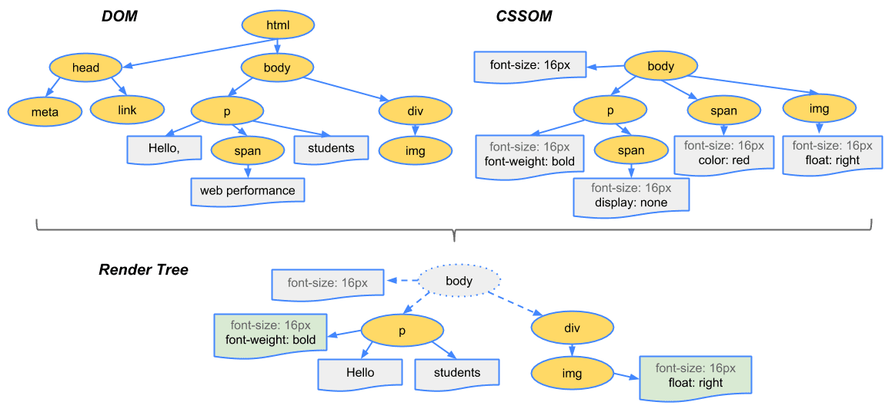
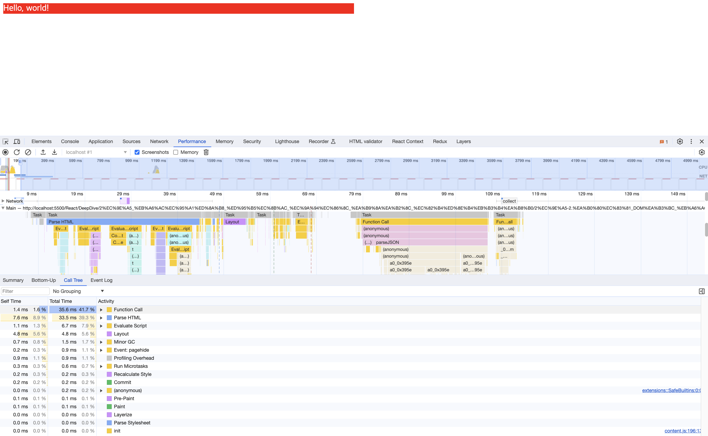
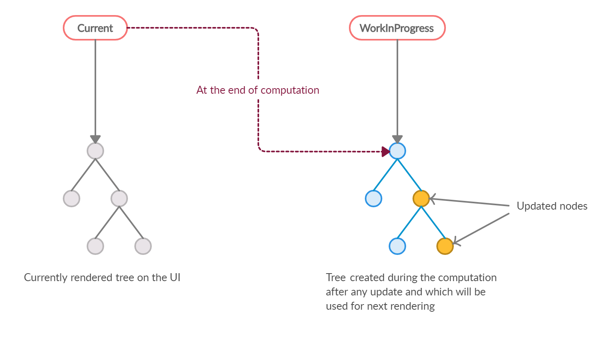

# 2. 가상 DOM과 리액트 파이버

리액트의 특징 중 가장 많이 언급되는 것 중 하나가 실제 DOM이 아닌 가상 DOM을 사용한다는 것이다.

## 2.1 DOM과 브라우저 렌더링

DOM(Document Object Model)은 웹페이지에 대한 인터페이스로 브라우저가 웹페이지의 콘텐츠와 구조를 어떻게 보여줄지에 대한 정보를 담고 있다.

<details>

<summary>브라우저가 화면을 그리는 과정</summary>

1. 브라우저가 사용자가 요청한 주소를 방문해 HTML 파일을 다운로드한다.
2. 브라우저의 렌더링 엔진은 HTML을 파싱해 DOM 노드로 구성된 트리(DOM)를 만든다.
3. 2번 과정에서 CSS 파일을 만나면 해당 CSS 파일도 다운로드한다.
4. 브라우저의 렌더링 엔진은 해당 CSS 파일도 파싱해 CSS 노드로 구성된 트리(CSSOM)를 만든다.
5. 브라우저는 2번에서 만든 DOM 노드를 순회하는데, 여기서 모든 노드를 방문하는 것이 아니고 사용자 눈에 보이는 노드만 방문한다.
   즉, `display: none`과 같이 사용자 화면에 보이지 않는 요소는 방문해 작업하지 않는다. 이는 트리를 분석하는 과정을 조금이라도 빠르게 하기 위함이다.
6. 눈에 보이는 노드를 대상으로 해당 노드에 대한 CSSOM 정보를 찾고 여기서 발견한 CSS 스타일 정보를 이 노드에 적용한다.
   이 DOM 노드에 CSS를 적용하는 과정은 크게 두 가지로 나뉜다.
   - 레이아웃(layout, reflow): 각 노드가 브라우저 화면의 어느 좌표에 정확히 나타나야 하는지 계산하는 과정, 이 과정을 거치면 반드시 페인팅 과정도 거치게 된다.
   - 페인팅(painting): 레이아웃 단계를 거친 노드에 색과 같은 실제 유효한 모습을 그리는 과정


_DOM과 CSSOM으로 렌더링 트리가 만들어지는 과정_

</details>

<details>

<summary>코드를 통한 렌더링 과정</summary>

```css
/* styles.css */
#text {
  background-color: red;
  color: white;
}
```

```html
<!-- index.html -->

<!DOCTYPE html>
<html>
  <head>
    <meta charset="UTF-8" />
    <link rel="stylesheet" type="text/css" href="./styles.css" />
    <title>Rendering</title>
  </head>
  <body>
    <div style="width: 100%;">
      <div id="text" style="width: 50%;">Hello, world!</div>
    </div>
  </body>
</html>
```

1. HTML을 다운로드한다. 다운로드와 함께 HTML을 분석한다.
2. 스타일시트가 포함된 `link` 태그를 발견해 `styles.css`를 다운로드한다.
3. `body` 태그 하단의 `div`는 `width: 100%`이므로 뷰포트 좌우 100% 너비로 잡는다.
4. 3번 하단의 `div`는 `width: 50%`이므로 부모 요소의 50% 너비로 잡는다.
5. 2번에서 다운로드한 `styles.css`를 분석하고, `id="text"`인 요소에 대한 스타일 정보를 결합한다.
6. 화면에 HTML 정보를 그리기 위한 모든 정보다 준비되었으므로 위 정보를 바탕으로 렌더링을 시작한다.


_HTML, CSS 코드가 렌더링 되는 과정_
_HTML을 파싱하고, 스타일을 계산하고, 레이아웃, 페인팅 등이 차례대로 일어난다._

</details>

## 2.2 가상 DOM의 탄생 배경

브라우저가 웹페이지를 렌더링하는 과정은 매우 복잡하고 많은 비용이 든다. 또한 대다수의 앱은 렌더링 이후 정보를 보여주는데 그치지 않고 사용자의 인터랙션을 통해 다양한 정보를 보여줘야 한다. 따라서 렌더링이 완료된 이후에도 사용자의 인터랙션으로 웹페이지가 변경되는 상황 또한 고려해야 한다.

**특정한 요소의 색상이 변경되는 경우**는 페인팅만 일어나므로 비교적 빠르게 처리할 수 있다.

**특정한 요소의 노출 여부가 변경되너가 사이즈가 변경되는 등 요소의 위치와 크기를 재계산하는 경우**는 **레이아웃**이 일어나고, 레이아웃은 필연적으로 **리페인팅**이 발생하기 때문에 더 많은 비용이 발생한다.

**DOM 변경이 일어나는 요소가 많은 자식 요소를 가지고 있는 경우**에는 하위 자식 요소도 변경되어야 하기 때문에 더 많은 비용을 브라우저와 사용자가 지불하게 된다.

이러한 렌더링 이후 추가 렌더링 작업은 하나의 페이지에서 모든 작업이 일어나는 싱글 페이지 애플리케이션(Single Page Application, SPA)에서 더 많이 발생한다.

싱글 페이지 애플리케이션(SPA)은 한 페이지에서 모든 작업이 이루어지며, 페이지 변경 시 전체 페이지를 새로 렌더링하는 전통적인 웹페이지와는 달리 현재 페이지에서 요소의 위치를 재계산하면서 추가 렌더링이 발생하는 특징이 있다. 라우팅 변경 시 특정 요소를 제외하고 대부분의 요소를 삭제하고 다시 삽입하며 위치를 재계산하는 작업이 두드러지며, 사용자는 페이지 이동 시 깜빡임 없이 자연스러운 경험을 얻을 수 있지만, DOM 관리에 따른 비용이 늘어나는 단점도 있다.

하나의 인터랙션으로 인해 페이지 내부의 DOM의 여러가지가 변경되는 시나리오는 최근 웹페이지에서 흔하게 볼 수 있다. 이러한 사용자 인터랙션에 따라 DOM의 모든 변경 사항을 추적하는 것은 매우 비효율적이다. 그리고 대부분의 경우 개발자는 인터랙션에 모든 DOM의 변경보다는 결과적으로 만들어지는 DOM 결과물 하나만 신경쓰게 된다. 이렇게 인터랙션에 따른 DOM의 최정 결과물을 간편하게 제공하는 것이 브라우저뿐만 아니라 개발자에게도 매우 유용하다.

이러한 문제점을 해결하기 위해 탄생한 것이 가상(Virtual) DOM이다. 가상 DOM은 말 그대로 실제 브라우저의 DOM이 아닌 리액트가 관리하는 DOM을 의미한다.
가상 DOM은 웹페이지가 표시해야할 DOM을 일단 메모리에 저장하고, 리액트가 실제 변경에 대한 준비가 완료 되었을 때 실제 브라우저의 DOM에 반영한다.

> 여기서의 리액트는 package.json에 있는 react가 아닌 react-dom을 의미한다.

이렇게 DOM 계산을 브라우저가 아닌 메모리에서 계산하는 과정을 한 번 거치게 되면 실제로는 여러번 발생했을 렌더링 과정을 최소화할 수 있고 브라우저가 처리해야 할 부담을 줄일 수 있다.

리액트의 이러한 방식이 일반적인 DOM을 관리하는 브라우저보다 빠르다고 오해할 수 있지만 무조건 빠른 것이 아니라 리액트의 가상 DOM 방식은 대부분의 상황에서 웬만한 애플리케이션을 만들 수 있을 정도로 충분히 빠른것이다.

## 2.3 가상 DOM을 위한 아키텍처, 리액트 파이버

리액트는 가상 DOM을 만들 수 있고 여러 번의 렌더링 과정을 압축해 최소한의 렌더링 단위를 만들 수 있다. 이러한 가상 DOM과 렌더링 과정 최적화를 가능하게 하는 것이 리액트 파이버(React Fiber)이다.

### 2.3.1 리액트 파이버란?

리액트 파이버는 리액트에서 관리하는 자바스크립트 객체이다. 파이버는 파이버 재조정자(fiber reconciler)가 관리한다.
파이버 재조정자는 가상 DOM과 실제 DOM을 비교해 변경 사항을 수집하며 만약 변경 사항이 있다면 변경에 관련된 정보를 가지고 있는 파이버를 기준으로 화면에 렌더링을 요청한다.

> 재조정자는 리액트에서 어떤 부분을 새롭게 렌더링해야 하는지 가상 DOM과 실제 DOM을 비교하는 알고리즘을 의미한다.

중요한 점은 이러한 모든 과정이 **비동기**로 일어난다는 것이다.

과거 리액트의 조정 알고리즘은 스택 알고리즘으로 이뤄져 있었다. 하나의 스택에 렌더링에 필요한 작업들이 쌓이면 이 스택이 빌 때까지 동기적으로 작업이 이뤄졌다는 것이다. 이러한 방식은 자바스크립트의 특징인 싱글 스레드로 인해 이 동기 작업은 중단될 수 없었고, 다른 작업이 수행되지 못하고 대기해야 하는 비효율적인 상황이 발생할 수 있었다.

<details>

<summary>스택 알고리즘의 문제점</summary>

예를 들어, `<input type="text" />`의 내용으로 자동 검색을 하는 UI가 있다고 가정했을 때 사용자는 빠르게 검색어를 입력하고 해당 결과물이 `input`뿐만 아니라 자동 검색을 위한 다른 UI나 내부 `fetch`에도 영향을 주는 경우가 있다.

`fetch` 작업이 수행되면 네트워크 요청이 발생하고 이에 따라 로딩 스피너도 나타난다. 이러한 작업이 모두 스택에 쌓인다고 가정했을 때
사용자가 입력할 때마다 스택에 쌓이는 작업이 많아질 수록 리애그는 동기식으로 작업을 처리하려고 하면서 작업에 많은 시간이 소요되고, 최악의 경우 글자 입력에 지연이 생길 수 있다.

사용자 인터랙션에 따른 동시 다발적인 이벤트와 애니메이션은 다양한 작업을 처리하는 최긘 웹 애플리케이션에서는 피할 수 없는 문제이다. 이러한 기존 렌더링 스택의 비효율성을 해결하기 위해 스택 조정자 대신 파이버라는 개념을 도입했다.

</details>

**파이버 구현**

파이버는 하나의 작업 단위로 구성되어 있다.

리액트는 이러한 작업 단위를 하나씩 처리하고 `finishedWork()`라는 작업으로 마무리하며, 이 작업을 커밋해 실제 브라우저 DOM에 가시적인 변경 사항을 만들어 낸다.

1. 렌더 단계: 리액트는 사용자에게 노출되지 않는 모든 비동기 작업을 수행한다.
   이 단계에서 파이버의 작업, 우선순위를 지정하거나 중지시키거나 버리는 등의 작업이 일어난다.
2. 커밋 단계: DOM에 실제 변경 사항을 반영하기 위한 작업이며, `commitWork()`가 실행되는데 동기식으로 일어나고 중단될 수도 있다.

<details>

<summary>파이버 구현 코드</summary>

```tsx
function FiberNode(tag, pendingProps, key, mode) {
  // Instance
  this.tag = tag; // 태그 유형 (예: 함수 컴포넌트, 클래스 컴포넌트, HTML 엘리먼트 등)
  this.key = key; // 엘리먼트의 고유 식별자
  this.elementType = null; // 요소의 타입 (클래스, 함수 등)
  this.type = null; // 컴포넌트 또는 DOM 엘리먼트의 실제 타입
  this.stateNode = null; // 해당 Fiber 노드와 연결된 인스턴스 또는 DOM 노드

  // Fiber
  this.return = null; // 부모 Fiber 노드
  this.child = null; // 첫 번째 자식 Fiber 노드
  this.sibling = null; // 다음 형제 Fiber 노드
  this.index = 0; // 해당 노드의 인덱스

  this.ref = null; // 렌더링된 엘리먼트의 참조
  this.refCleanUp = null; // 참조의 정리 함수

  this.pendingProps = pendingProps; // 대기 중인 엘리먼트의 속성
  this.memoizedProps = null; // 메모이제이션된 엘리먼트의 속성
  this.updateQueue = null; // 상태 및 속성 업데이트를 관리하는 큐
  this.memoizedState = null; // 메모이제이션된 엘리먼트의 상태
  this.dependencies = null; // useEffect 등에서 사용되는 의존성 객체

  this.mode = mode; // React 모드 (예: Concurrent 모드)

  // Effects
  this.flags = NoFlags; // 업데이트 플래그 (예: 작업 수행 여부 등)
  this.subtreeFlags = NoFlags; // 서브트리의 업데이트 플래그
  this.deletions = null; // 삭제된 엘리먼트 목록

  this.lanes = NoLanes; // 작업 스케줄링을 위한 레인 정보
  this.childLanes = NoLanes; // 자식 노드들의 레인 정보

  this.alternate = null; // 이전 상태의 Fiber 노드

  // 프로파일러, __DEV__ 코드는 생략...
}
```

파이버는 단순한 자바스크립트 객체로 구성되어 있다.

파이버와 리액트 요소의 중요한 차이점은 리액트 요소는 렌더링이 발생할 때마다 새롭게 생성되지만 파이버는 재사용된다는 것이다. 컴포넌트가 최초로 마운트되는 시점에 생성되어 이후에는 재사용된다.

</details>

<details>

<summary>파이버를 생성하는 함수</summary>

```tsx
var createFiber = function (tag, pendingProps, key, mode) {
  return new FiberNode(tag, pendingProps, key, mode);
};

// 생략...

function createFiberFromElement(element, mode, lanes) {
  var owner = null;

  {
    owner = element._owner;
  }

  var type = element.type;
  var key = element.key;
  var pendingProps = element.props;
  var fiber = createFiberFromTypeAndProps(
    type,
    key,
    pendingProps,
    owner,
    mode,
    lanes
  );

  {
    fiber._debugSource = element._source;
    fiber._debugOwner = element._owner;
  }

  return fiber;
}

function createFiberFromFragment(elements, mode, lanes, key) {
  var fiber = createFiber(Fragment, elements, key, mode);
  fiber.lanes = lanes;
  return fiber;
}
```

</details>

<details>

<summary>주요 속성</summary>

- `tag`: 파이버는 하나의 `elemnet`에 하나가 생성되는 1:1 관계이다. 이때 1:1로 매칭된 정보를 가지고 있는 것이 `tag`이다.
  1:1로 연결되는 것은 리액트의 컴포넌트일 수도, HTML의 DOM 노드일 수도, 혹은 다른 어떤 것일 수도 있다. 어떤 값들이 가능한지는 아래를 통해 확인할 수 있다.

  <details>

  <summary>파이버의 <code>tag</code></summary>

  ```tsx
  var FunctionComponent = 0;
  var ClassComponent = 1;
  var IndeterminateComponent = 2;
  var HostRoot = 3;
  var HostPortal = 4;
  var HostComponent = 5;
  var HostText = 6;
  var Fragment = 7;
  var Mode = 8;
  var ContextConsumer = 9;
  var ContextProvider = 10;
  var ForwardRef = 11;
  var Profiler = 12;
  var SuspenseComponent = 13;
  var MemoComponent = 14;
  var SimpleMemoComponent = 15;
  var LazyComponent = 16;
  var IncompleteClassComponent = 17;
  var DehydratedFragment = 18;
  var SuspenseListComponent = 19;
  var ScopeComponent = 21;
  var OffscreenComponent = 22;
  var LegacyHiddenComponent = 23;
  var CacheComponent = 24;
  var IncompleteForwardRefComponent = 25;
  ```

  `HostComponent`가 웹의 `div`와 같은 요소를 의미한다.
  </details>

- `stateNode`: 파이버 자체에 대한 참조(reference) 정보를 가지고 있으며, 이 참조를 바탕으로 리액트는 파이버와 관련된 상태에 접근한다.
- `child`, `sibling`, `return`: 파이버 간의 관계 개념을 나타낸다.
  리액트 컴포넌트 트리가 형성되는 것과 동일하게 파이버도 트리 형식을 갖게 되는데, 트리 형식을 구성하는 데 필요한 정보가 이 속성 내부에 정의된다.
  리액트 컴포넌트 트리와 다른 점은 `children`이 없다는 것이다. 즉, 하나의 `child`만 존재한다.

  <details>

  <summary>여러 개의 자식이 있는 구조</summary>

  ```html
  <ul>
    <li>1</li>
    <li>2</li>
    <li>3</li>
  </ul>
  ```

  파이버의 자식은 항상 첫 번째 자식의 참조로 구성되므로 `<ul/>` 파이버 자식은 첫 번째 `<li/>` 파이버가 된다.
  그리고 나머지 두 개의 `<li/>` 파이버는 형제, 즉 `sibling`으로 구성된다.
  마지막으로 `return`은 부모 파이버를 의미하며 여기에서 모든 `<li/>` 파이버는 `<ul/>` 파이버를 `return`으로 갖게 된다.

  <details>

  <summary>관계도</summary>

  ```tsx
  const l3 = {
    return: ul,
    index: 2,
  };

  const l2 = {
    sibling: l3,
    return: ul,
    index: 1,
  };

  const l1 = {
    sibling: l2,
    return: ul,
    index: 0,
  };

  const ul = {
    // ...
    child: l1,
  };
  ```

  </details>

- `index`: 여러 형제들(`sibling`) 사이에서 자신의 위치가 몇 번째인지 숫자로 표현한다.
- `pendingProps`: 아직 작업을 처리하지 못한 `props`
- `memoizedProps`: `pendingProps`를 기준으로 렌더링이 완료된 이후에 `pendingProps`를 `memoizedProps`로 저장해 관리한다.
- `updateQueue`: 상태 업데이트, 콜백 함수, DOM 업데이트 등 필요한 작업을 담아두는 큐.
  <details>

  <summary>updateQueue의 구조</summary>

  ```tsx
  type UpdateQueue = {
    first: Update | null;
    last: Update | null;
    hasForceUpdate: boolean;
    callbackList: null | Array<Callback>; // setState로 넘긴 콜백 목록
  };
  ```

  </details>

- `memoizedState`: 함수형 컴포넌트의 훅 목록을 관리한다. 단순 `useState`뿐만 아니라 모든 훅 리스트가 저장된다.
- `alternate`: 리액트의 트리는 두 개인데, `alternate`는 반대편 트리 파이버를 가리킨다.

</details>

이렇게 생성된 파이버는 `state`가 변경되거나 생명주기 메서드가 실행되거나 DOM의 변경이 필요한 시점 등에 실행된다.

중요한 것은 리액트가 파이버를 처리할 때마다 이러한 작업을 직접 바로 처리하기도하고 스케쥴링하기도 한다는 것이다.
즉, 이러한 작업들은 작은 단위로 나눠서 처리할 수도 애니메이션과 같이 우선순위가 높은 작업은 가능한 빠르게 처리하거나, 낮은 작업을 연기시크는 등 유연하게 처리된다.

파이버의 객체 값에서 알 수 있듯이 리액트의 핵심 원칙은 UI를 문자열, 숫자, 배열과 같은 값으로 관리한다는 것이다.
변수에 이러한 UI 관련 값을 보관하고, 리액트의 자바스크립트 코드 흐름에 따라 관리하고 표현하는 것이 리액트의 핵심이다.

### 2.3.2 리엑트 파이버 트리

파이버 트리는 리액트 내부에서 두 개가 존재한다. 하나는 현재 모습을 담은 파이버 트리이고 다른 하나는 작업 중인 상태를 나타내는 `workInProgress` 파이버 트리이다.

리액트 파이버의 작업이 끝나면 리액트는 단순히 포인터만 변경해 `workInProgress` 파이버 트리를 현재 파이버 트리로 변경한다. 이러한 기술을 더블 버퍼링(Double Buffering)이라고 한다.

<details>

<summary>더블 버퍼링</summary>

더블 버퍼링은 컴퓨터 그래픽 분야에서 사용되는 언어이다.
그래픽을 통해 화면에 표시되는 것을 그리기 위해서 내부적으로 처리를 거쳐야 하는데 이러한 처리를 거치게 되면 사용자에게 미처 다 그리지 못한 모습을 보여줄 수 있다.

> 한 번에 모든 작업을 마무리해 다 그릴 수 없기 때문

이러한 문제를 해결하기 위해 보이지 않는 곳에서 다음에 그려야할 그림을 미리 그린 다음, 완성되면 현재 상태를 새로운 그림으로 바꾸는 기법을 더블 버퍼링이라고 한다.

</details>



리액트에서도 다 그리지 못한 모습을 노출시키지 않기 위해(불완전한 트리를 보여주지 않기 위해) 더블 버퍼링 기법을 사용하는데, 이러한 더블 버퍼링을 위해 두 개의 트리가 존재하며 커밋 단계에서 더블 버퍼링이 일어난다.

즉, 먼저 현재 UI 렌더링을 위해 존재하는 트리인 `current`를 기준으로 모든 작업이 시작된다.
만약 업데이트가 발생하면 파이버는 리액트에서 새로 받은 데이터로 새로운 `workInProgress` 트리를 빌드하기 시작한다. `workInProgress` 트리를 빌드하는 작업이 끝나면 다음 렌더링에 이 트리를 사용하고 이 `workInProgress` 트리가 UI에 최종적으로 렌더링 되어 반영이 완료되면 `current`가 이 `workInProgress`로 변경된다.

### 2.3.3 파이버 작업 순서

파이버 노드의 생성 흐름은 아래와 같다.

1. 리액트는 `beginWork()`를 실행해 파이버 작업을 수행하는데, 더 이상 자식이 없는 파이버를 만날 때까지 트리 형식으로 시작된다.
2. 1번 작업이 끝난다면 그 다음 `completeWork()`를 실행해 파이버 작업을 완료한다.
3. 형제가 있다면 형제로 넘어간다.
4. 2번, 3번이 모두 끝났다면 `return`으로 돌아가 작업이 완료되었음을 알린다.

<details>

<summary>파이버 작업 순서 예시</summary>

```tsx
<A1>
  <B1>Hello</B1>
  <B2>
    <C1>
      <D1 />
      <D2 />
    <C1 />
  </B2>
  <B2 />
</A1>
```

1. `A1`의 `beginWork()`가 실행된다.
2. `A1`은 자식이 있으므로 `B1`으로 이동해 `beginWork()`를 실행한다.
3. `B1`은 자식이 없으므로 `completeWork()`를 실행한다. 형제인 `B2`로 이동한다.
4. `B2`의 `beginWork()`를 실행하고 자식이 있으므로 `C1`로 이동한다.
5. `C1`의 `beginWork()`를 실행하고 자식이 있으므로 `D1`로 이동한다.
6. `D1`의 `beginWork()`를 실행한다.
7. `D1`은 자식이 없으므로 `completeWork()`를 실행한다. 형제인 `D2`로 이동한다.
8. `D2`는 자식이 없으므로 `completeWork()`를 실행한다.
9. `D2`는 자식도 없고 형제도 없으므로 위로 이동해 `D1`, `C1`, `B2`의 `completeWork()`를 실행한다.
10. `B2`는 형제인 `B3`로 이동해 `beginWork()`를 실행한다.
11. `B3`의 `completeWork()`가 실행되면 반환되며 상위로 올라간다.
12. `A1`의 `completeWork()`가 실행된다.
13. 루트 노드가 완성되는 순간, 최종적으로 `commitRoot()`가 실행되고 변경 사항을 비교해 업데이트가 필요하면 변경 사항이 DOM에 반영된다.


_코드를 파이버 트리로 표현_

`setState` 등으로 업데이트가 발생하면, 이미 리액트는 앞서 만든 `current` 트리가 존재하고 `setState`로 인한 업데이트 요청을 받아 `workInProgress` 트리를 다시 빌드하기 시작한다. 빌드 과정은 트리를 만드는 과정과 동일하다.

최초 렌더링 시에는 모든 파이버를 새롭게 만들어야 했지만, 파이버가 이미 존재하므로 새로 생성하지 않고 기존 파이버에서 업데이트 된 `props`를 받아 파이버 내부에서 처리한다.

</details>

일반적인 리액트 애플리케이션에서 트리를 비교해 업데이트하는 작업은 무수히 많이 발생한다. 이러한 반복적인 재조정 작업 때마다 새롭게 파이버 자바스크립트 객체를 만드는 것은 리소스 낭비이다. 따라서 가급적 객체를 새롭게 만들기 보다는 기존에 있는 객체를 재활용하기 위해 내부 속성값만 초기화 하거나 바꾸는 형태로 트리를 업데이트 한다.

과거에는 동기식으로 해당 작업을 처리했다. 이 트리 업데이트 과정, 재귀적으로 하나의 트리를 순회해 새로운 트리를 만드는 작업은 동기식이고 중단될 수 없었다. 그러나 현재는 우선순위가 높은 다른 업데이트가 발생하면 현재 업데이트 작업을 일시 중단하거나 새롭게 만들거나, 폐기할 수도 있다. 또한 작업 단위를 나눠 우선순위를 할당하는 것도 가능하다.

리액트는 이러한 작업을 파이버 단위로 나눠 수행한다. 애니메이션이나 사용자가 입력하는 작업은 우선순위가 높은 작업으로 분류하거나, 목록을 렌더링하는 등의 작업은 우선순위가 낮은 작업으로 분리해 초적의 순위로 작업을 완료할 수 있게끔 만든다.

## 2.4 파이버와 가상 DOM

리액트 컴포넌트에 대한 정보를 1:1로 가지고 있는 것이 파이버이며, 파이버는 리액트 아키텍처 내부에서 비동기로 이뤄진다.

이러한 비동기 작업과 달리, 실제 브라우저 구조인 DOM에 반영하는 것은 동기적으로 일어나야 하고 처리하는 작업이 많아 화면에 불완전하게 표시될 수 있는 가능성이 높으므로 이러한 작업을 가상에서, 즉 메모리 상에서 먼저 수행해 최종적인 결과물만 실제 브라우저 DOM에 적용한다.

리액트 파이버는 리액트 네이티브와 같은 브라우저 이외의 환경에서도 사용할 수 있기 때문에 파이버와 가상 DOM은 동일한 개념이 아니며, 렌더러가 달라도 내부적으로 파이버를 통해 조정되는 과정은 동일하기 때문에 동일한 재조정자를 사용할 수 있다.

## 2.5 요약

가상 DOM과 파이버는 단순히 브라우저에 DOM을 변경하는 작업보다 빠르다는 이유만으로 만들어 진것은 아니다.
만약 이러한 도움 없이 직접 DOM을 수동으로 변경해야 한다면 어떤 값이 변경 되었는지, 그 값에 따라 어떠한 값이 변경되었고 이와 관련된 것들이 무엇이 있는지를 파악하기 어렵다.
이러한 어려움을 리액트 내부의 파이버와 재조정자가 내부적인 알고리즘을 통해 관리해줌으로써 웹 애플리케이션을 효율적으로 유지보수하고 관리할 수 있게 된다.

브라우저의 DOM을 더욱 빠르게 반영하는 것이 아니라 바로 값으로 UI를 표현하는 것이다.
화면에 표시되는 UI를 자바스크립트 문자열, 배열 등과 마찬가지로 값으로 관리하고 흐름을 효율적으로 관리하기 위한 메커니즘이 리액트의 핵심이다.
