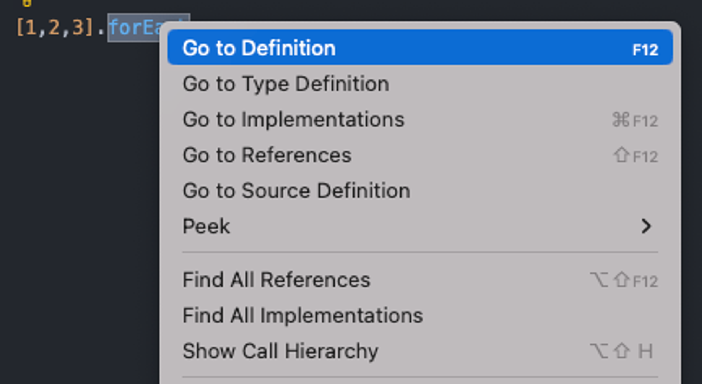
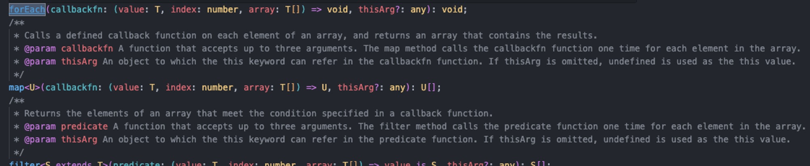

타입스크립트는 구현과 별도로 타입 형태를 선언할 수 있다.
타입 선언은 파일 이름이 `.d.ts` 확장자로 끝나는 **“선언 파일declaration file”** 에 작성된다. 선언 파일은 일반적으로 프로젝트 내에서 작성되고, 프로젝트의 컴파일 된 `npm` 패키지로 빌드 및 배포되거나 독립 실행형standalone `typings` 패키지로 공유된다.

# 1. 선언 파일

`.d.ts` 선언 파일은 런타임 코드를 포함할 수 없다는 주목할 만한 제약 사항을 제외하고는 `.ts` 파일과 유사하게 작동한다. `.d.ts` 파일에는 사용 가능한 런타임 값, 인터페이스, 모듈, 일반적인 타입의 설명만 포함된다. `.d.ts` 파일은 자바스크립트로 컴파일할 수 있는 모든 런타임 코드를 포함할 수 없다.

선언 파일은 다른 타입스크립트 파일과 마찬가지로 임포트해서 사용할 수 있다.

아래 `types.d.ts` 파일은 `index.ts` 파일에서 사용하는 `Character` 인터페이스를 내보낸다.

```tsx
export interface Character {
  catchphrase?: string;
  name: string;
}
```

```tsx
// 11.Declaration/01-1.index.ts

import { Character } from "./types";

export const characters: Character = {
  catchphrase: "Expelliarmus",
  name: "Harry Potter",
};
```

> 💡 선언 파일은 값이 아닌 타입만 선언할 수 있는 코드 영역을 의미하는 **“앰비언트 컨택스트ambient context”** 를 생성한다.

# 2.런타임 값 선언

비록 선언 파일은 함수 또는 변수 같은 런타임 값을 생성하지 않을 수 있지만, `declare` 키워드를 사용해 이러한 구조체가 존재한다고 선언할 수 있다. 이렇게 하면 웹 페이지의 `<script>` 태그 같은 일부 외부 작업이 특정 타입의 이름을 사용해 값을 생성했음을 타입 시스템에 알린다.

`declare`로 변수를 선언하면 초깃값이 허용되지 않는 다는 점을 제외하고 일반적인 변수 선언과 동일한 구문을 사용한다.

아래 코드는 `declared` 변수를 성공적으로 선언하지만 `initializer` 변수에 값을 제공하려고 하면 타입 오류가 발생한다.

```tsx
declare let declare: string;

declare let initialize: string = "Wanda";
//                               ^^^^^^^ Initializers are not allowed in ambient contexts.
```

함수와 클래스도 일반적인 형식과 유사하게 선언되지만 함수 또는 메서드의 본문이 없다.

아래 `canGrantWish` 함수와 메서드는 본문 없이 올바르게 선언되지만, `grantWish` 함수와 메서드는 본문을 설정하려는 부적절한 시도로 인해 구문 오류가 발생한다.

```tsx
declare function canGrantWish(wish: string): boolean;

declare function grantWish(wish: string) {
  //                                     ^ An implementation cannot be declared in ambient contexts.
  return true;
};

class Fairy {
  canGrantWish(wish: string): boolean;

  grantWish(wish: string) {
    //                    ^ An implementation cannot be declared in ambient contexts.
    return true;
  }
}
```

> 💡 타입스크립트의 암시적 `any` 타입의 규칙은 일반 소스 코드와 마찬가지로 앰비언트 컨텍스트에 선언된 함수와 변수에 대해 동일하기 작동한다. 앰비언트 컨텍스트는 함수 본문이나 초기 변수값을 제공하지 않을 수 있으므로 명시적 타입 애너테이션(명시적 반환 타입 애너테이션 포함)은 일반적으로 `any` 타입이 되는 것을 막는 유일한 방법이다.

`declare` 키워드를 사용한 타입 선언은 `.d.ts` 선언 파일에서 사용하는게 가장 일반적이지만, 선언 파일 외부에서도 사용할 수 있다. 모듈 또는 스크립트 파일에서도 `declare` 키워드를 사용할 수 있다. 전역으로 사용 가능한 변수가 해당 파일에서만 사용되어야 하는 경우 `declare` 키워드가 유용하다.

아래 `myGlobalValue` 변수는 `index.ts` 파일에 정의되었으므로 해당 파일에서 사용할 수 있다.

```tsx
declare const myGlobalValue: string;

console.log(myGlobalValue);
```

인터페이스와 같은 타입 형태는 `.d.ts` 선언 파일에서는 `declare` 키워드 유무와는 관계없이 허용되지만, 함수나 변수 같은 런타임 구문에 `declare` 키워드가 없다면 타입 오류가 발생한다.

```tsx
interface Writer {}
declare interface Writer {}

declare const fullName: string;
declare const firstName: "Liz";

const lastName = "Lemon";
//^^^ Top-level declarations in .d.ts files must start with either a 'declare' or 'export' modifier.
```

## 2.1 전역 변수

`import` 또는 `export` 문이 없는 타입스크립트 파일은 모듈이 아닌 스크립트로 취급되기 때문에 여기에 선언된 타입을 포함한 구문은 전역으로 사용된다. `import` 또는 `export`가 없는 선언 파일은 해당 동작의 이점을 사용해 타입을 전역으로 선언할 수 있다. 전역 선언 파일은 애플리케이션의 모든 파일에 걸쳐서 사용할 수 있는 전역 타입 또는 변수를 선언하는데 특히 유용하다.

아래 `global.d.ts` 파일은 전역으로 존재하는 `const version: strong`을 선언한다. 그러면 `version.ts` 파일은 `global.d.ts` 파일을 가져오지 않아도 전역으로 선언된 `version` 변수를 참조할 수 있다.

```tsx
declare const version: string;
```

```tsx
export function logVersion() {
  console.log(`Vserion: ${version}`);
}
```

전역으로 선언된 값은 전역 변수를 사용하는 브라우저 애플리케이션에서 가장 자주 사용된다. 대부분의 최신 웹 프레임워크는 일반적으로 ECMA스크립트 모듈 같은 최신 기술을 사용하지만, 변수를 전역으로 저장하는 작업은 특히 작은 프로젝트에서는 여전히 유용하다.

> 💡 `.d.ts` 파일에 선언된 전역 타입에 자동으로 접근할 수 없는 경우 `.d.ts` 파일이 아무것도 가져오거나 내보내지 않는지 다시 확인해야 한다. 하나의 `export`로도 전체 파일을 더 이상 전역으로 사용할 수 없게 만들 수도 있다.

## 2.2 전역 인터페이스 병합

변수는 타입스크립트의 타입 시스템에서 떠돌아다니는 유일한 전역은 아니다. 전역 `API`와 값에 대한 많은 타입 선언이 전역으로 존재한다. 인터페이스는 동일한 이름의 다른 인터페이스와 병합되기 때문에 `import`와 `export` 문이 없는 `.d.ts` 선언 파일 같은 전역 스크립트 컨텍스트에서 인터페이스를 선언하면 해당 인터페이스가 전역으로 확장된다.

예를 들어 서버에 따라 설정된 전역 변수에 의존하는 웹 애플리케이션은 해당 변수를 전역 Window 인터페이스에 존재하도록 선언하고 싶을 수 있다. 인터페이스 병합을 이용하면 `types/www.d.ts`와 같은 파일에서 `Window` 타입의 전역 `window` 변수에 존재하는 변수를 선언할 수 있도록 허용한다.

```html
<script type="text/javascript">
  window.myVersion = "3.1.1";
</script>
```

```tsx
interface Window {
  myVersion: string;
}
```

```tsx
export function logWindowVersion() {
  console.log(`Window version is : ${window.myVersion}`);
  window.alert("Built-in window types still work!");
}
```

## 2.3 전역 확장

다른 곳에 정의된 타입을 가져와서 전역 정의를 크게 단순화 할 때와 같이 전역 범위로 확장이 필요한 `.d.ts` 파일에 `import` 또는 `export` 문을 항상 금지할 수 있는 것은 아니다. 경우에 따라서 모듈 파일에 선언된 타입이 전역으로 사용되어야 한다.

타입스크립트에서 `declare global` 코드 블록 구문을 사용해 해당 블록 내용이 전역 컨텍스트에 있다고 표시한다.

```tsx
// (모듈 컨텍스트)
declare global {
  // (전역 컨텍스트)
}

// (모듈 컨텍스트)
```

다음 `types/data.d.ts` 파일은 `Data` 인터페이스를 내보내고, 나중에 `types/global.d.ts`와 런타임 `index.ts` 파일에서 이 인터페이스를 가져온다.

```tsx
export interface Data {
  version: string;
}
```

또한 `types/global.d.ts` 파일에서만 사용할 수 있는 변수와 `Data` 타입 변수를 `declare global` 블록 내에 전역으로 선언한다.

```tsx
import { Data } from "./data";

declare global {
  const globallyDeclared: Data;
}

declare const locallyDeclared: Data;
```

그러면 `index.ts`는 `import` 문 없이 `globallyDeclared` 변수에 접근할 수 있고, 여전히 `Data`를 가져와야 한다.

```tsx
import { Data } from "./types/data";

function logData(data: Data) {
  console.log(`Data version is: ${data.version}`);
}

logData(globallyDeclared);

logData(locallyDeclared);
//      ^^^^^^^^^^^^^^^ Cannot find name 'locallyDeclared'. Did you mean 'globallyDeclared'?
```

전역 선언과 모듈 선언이 함께 잘 작동하도록 랭글링wrangling하는 것은 까다로울 수 있다. 타입스크립트의 `declare`와 `global` 키워드를 적절히 사용하면 프로젝트에서 전역으로 사용 가능한 타입 정의를 설명할 수 있다.

# 3. 내장된 선언

타입스크립트는 지금까지 타입 검사를 진행해왔다. `Array`, `Function`, `Map`, `Set`과 같은 전역 객체는 타입 시스템이 알아야 하지만 코드에서 선언되지 않는 구문이다. 이와 같은 전역 객체는 디노, Node.js, 웹 브라우저 등에서 실행되는 런타임 코드에 의해 제공된다.

## 3.1 라이브러리 선언

모든 자바스크립트 런타임에 존재하는 `Array`, `Function` 같은 내장된 전역 객체는 `lib.[target].d.ts` 파일 이름으로 선언된다. 여기에서 `target`은 `ES5`, `ES2020` 또는 `ESNext`와 같이 프로젝트에서 대상으로 하는 자바스크립트의 최소 지원 버전이다.

내장된 라이브러리 선언 파일 또는 ‘`lib` 파일’은 자바스크립트의 내장된 `API` 전체를 나타내기 때문에 상당히 크다. 예를 들어 내장 `Array` 타입의 멤버는 다음과 같이 시작하는 전역 `Array` 인터페이스로 구현한다.

```tsx
// lib.es5.d.ts

interface Array<T> {
  /**
   * Gets or sets the length of the array. This is a number one higher than the highest index in the array.
   */
  length: number;
  /**
   * Returns a string representation of an array.
   */
  toString(): string;
  // ...
}
```

`lib` 파일은 타입스크립트 `npm` 패키지의 일부로 배포되며 `node_modules/typescript/lib.ed5.d.ts`와 같은 경로의 패키지 내부에서 찾을 수 있다. 자체 패키지 타입스크립트 버전으로 검사 코드를 입력하는 VSCode 같은 IDE에서는 아래 사진처럼 배열의 `forEach` 내장 메서드에서 오른쪽 마우스를 클릭해 “Go to Definition”을 선택하면 `lib` 파일을 찾을 수 있다.


_forEach을 마우스 우클릭 후 Go to Definition_


_결과로 열린 lib.ed5.d.ts 파일_

### 3.1.1 라이브러리 target

타입스크립트는 기본적으로 `tsc` `CLI` 또는 프로젝트의 `tsconfig.json`(기본값은 `es5`)에서 제공된 `target` 설정에 따라 적절한 `lib` 파일을 포함한다. 자바스크립트 최신 버전에 대한 연속적인 `lib` 파일들은 인터페이스 병합을 사용해 서로 빌드된다.

예를 들어 `ES2015`에 추가된 `EPSILON`, `isFinite`와 같은 정적 `Number` 멤버는 `lib.es2015.d.ts`에 나열된다.

```tsx
// lib.es2015.d.ts

interface NumberConstructor {
  /**
   * The value of Number.EPSILON is the difference between 1 and the smallest value greater than 1
   * that is representable as a Number value, which is approximately:
   * 2.2204460492503130808472633361816 x 10‍−‍16.
   */
  readonly EPSILON: number;

  /**
   * Returns true if passed value is finite.
   * Unlike the global isFinite, Number.isFinite doesn't forcibly convert the parameter to a
   * number. Only finite values of the type number, result in true.
   * @param number A numeric value.
   */
  isFinite(number: unknown): boolean;
  // ...
}
```

타입스크립트 프로젝트는 `target`으로 지정한 자바스크립트 버전의 모든 최소 버전 `lib` 파일을 포함한다. 예를 들어 `target`이 `es2016`인 프로젝트에는 `lib.es5.d.ts`, `lib.es2015.d.ts` 그리고 `lib.es2016.d.ts`까지 포함된다.

> 💡 `target`보다 최신 버전의 자바스크립트에서만 사용할 수 있는 기능은 타입 시스템에서 사용할 수 없다. 예를 들어 `target`이 `es5`이면, `String.prototype.startsWith`와 같은 `ES2015` 이상의 기능은 인식되지 않는다.

## 3.2 DOM 선언

자바스크립트 언어 자체 외에 가장 일반적으로 참조되는 타입 선언 영역은 웹 브라우저를 위한것이다.

“**`DOM`** Document Object Model” 타입이라고 하는 웹 브라우저 타입은 `localStorage`와 같은 `API`와 웹 브라우저에서 주로 사용하는 `HTMLElement`와 같은 타입 형태를 다룬다. `DOM` 타입은 `lib.dom.d.ts` 파일과 다른 `lib.*.d.ts` 선언 파일에도 저장된다.

많은 내장 전역 타입처럼 전역 `DOM` 타입은 종종 전역 인터페이스로 설명된다. 예를 들어 `localStorage`와 `sessionStorage`에 사용되는 `Storage` 인터페이스는 대략 다음과 같이 시작한다.

```tsx
// lib.dom.ts

interface Storage {
  /**
   * Returns the number of key/value pairs.
   *
   * [MDN Reference](https://developer.mozilla.org/docs/Web/API/Storage/length)
   */
  readonly length: number;
  /**
   * Removes all key/value pairs, if there are any.
   *
   * Dispatches a storage event on Window objects holding an equivalent Storage object.
   *
   * [MDN Reference](https://developer.mozilla.org/docs/Web/API/Storage/clear)
   */
  clear(): void;
  /**
   * Returns the current value associated with the given key, or null if the given key does not exist.
   *
   * [MDN Reference](https://developer.mozilla.org/docs/Web/API/Storage/getItem)
   */
  getItem(key: string): string | null;
  /**
   * Returns the name of the nth key, or null if n is greater than or equal to the number of key/value pairs.
   *
   * [MDN Reference](https://developer.mozilla.org/docs/Web/API/Storage/key)
   */
  key(index: number): string | null;
  // ...
}
```

`lib` 컴파일러 옵션을 재정의하지 않는 타입스크립트 프로젝트는 `DOM` 타입을 기본으로 포함한다. Node.js와 같은 브라우저가 아닌 환경에서 실행되는 프로젝트는 타입 시스템이 존재한다고 주장하는 `document`와 `localStorage` 같은 전역 `API`에 접근할 수 없기 때문에 개발자가 혼란스러울 수 있다.

# 4. 모듈 선언

선언 파일의 또 다른 중요한 기능은 모듈의 상태를 설명하는 기능이다. 모듈의 문자열 이름 앞에 declare 키워드를 사용하면 모듈의 내용을 타입 시스템에 알릴 수 있다.

아래 `“my-example-lib”` 모듈은 modules.d.ts 선언 스크립트 파일에 존재하도록 선언한 다음, index.ts 파일에서 사용된다.

```tsx
declare module "my-example-module" {
  export const value: string;
}
```

```tsx
import { value } from "my-example-module";

console.log(value);
```

코드에서 `declare module`을 자주 사용해서는 안된다. `declare module`은 주로 “와일드카드wildcard” 모듈 선언과 이 장의 후반부에서 다루는 패키지 타입과 함께 사용된다.

## 4.1 와일드카드 모듈 선언

모듈 선언은 자바스크립트와 타입스크립트 파일 확장자가 아닌 특정 파일의 내용을 코드로 가져올 수 있음을 웹 애플리케이션에 알리기 위해 사용한다. 모듈 선언으로 하나의 `*` 와일드카드를 포함해 해당 패턴과 일치하는 모든 모듈을 나타낼 수 있다.

예를 들어 `create-react-app`과 `create-next-app` 같은 인기 있는 리액트 스타터starter에 미리 구성된 것처럼 많은 웹 프로젝트는 CSS 모듈을 지원하며 CSS 파일에서 런타임에 사용할 수 있는 객체로 스타일을 가져온다. 기본적으로 `{ [i: string]: string }` 타입의 객체를 내보내는 `“*.modulecss”`와 같은 패턴으로 모듈을 정의한다.

```tsx
declare module "*.module.css" {
  const styles: { [i: string]: string };
  export default styles;
}
```

```tsx
import styles from "./04-2.module.css";

styles.anyClassName; // 타입은 string
```

> 💡 와일드카드 모듈을 사용해 로컬 파일을 나타내는 방식이 타입 안정성을 완벽히 보장하지는 않는다. 타입스크립트는 가져온 모듈 경로가 파일과 일치하는지 확인하는 메커니즘을 제공하지 않는다. 일부 프로젝트는 웹팩webpack 같은 빌드 시스템을 사용하거나 로컬 파일에서 `.d.ts` 파일을 생성해 가져오기가 가능한지 확인한다.

# 5. 패키지 타입

프로젝트 내에서 `declare`를 사용하는 방법을 살펴봤으므로 이제 패키지 간에 타입을 사용하는 방법을 다룰 차례다. 타입스크립트로 작성된 프로젝트는 여전히 `.js`로 컴파일된 파일이 포함된 패키지를 배포한다. 일반적으로 `.d.ts` 파일을 사용해 이러한 자바스크립트 파일 뒤에 타입스크립트 타입 시스템 형태를 지원하도록 선언한다.

## 5.1 선언

타입스크립트는 입력된 파일에 대한 `.d.ts` 출력 파일과 자바스크립트 출력 파일을 함께 생성하는 선언 옵션을 제공한다.

아래 `index.ts` 소스 파일이 주어졌다고 가정해보자.

```tsx
export const greet = (text: string) => {
  console.log(`Hello, ${text}`);
};
```

`module`은 `es2015`, `target`은 `es2015`인 선언 옵션을 사용해 다음 출력 파일을 생성한다.

```bash
tsc --module es2015 --target es2015 11.Declaration/05-1.index.ts
```

```tsx
export declare const greet: (text: string) => void;
```

```jsx
export const greet = (text) => {
  console.log(`Hello, ${text}`);
};
```

자동으로 생성된 `.d.ts` 파일은 프로젝트에서 사용자가 사용할 타입 정의를 생성하는 가장 좋은 방법이다. 일반적으로 `.js` 파일을 생성하는 타입스크립트로 작성된 대부분의 패키지도 해당 파일과 함께 `.d.ts`를 번들로 묶는 것이 좋다.

## 5.2 패키지 타입 의존성

타입스크립트는 프로젝트의 `node_modules` 의존성dependency 내부에서 번들로 제공되는 `.d.ts` 파일을 감지하고 활용할 수 있다. 이러한 파일은 해당 패키지에서 내보낸 타입 형태에 대해 마치 동일한 프로젝트에서 작성되었거나 선언 모듈 블록으로 선언된 것처럼 타입 시스템에 알린다.

자체 `.d.ts` 선언 파일과 함께 제공되는 npm 모듈은 대부분 아래와 같은 파일 구조를 같는다.

```
lib/
 index.js
 index.d.ts
package.json
```

예를 들어 꾸준히 인기 있는 테스트 프레임워크인 제스트Jest는 타입스크립트로 작성되었으며 `jest` 패키지 내에 자체 번들 `.d.ts` 파일을 제공한다. `describe`와 `it` 같은 함수를 제공하는 `@jest/globals` 패키지에 대한 의존성을 가지며 `jest`는 전역으로 사용할 수 있다.

```json
// package.json

{
  // ...
  "dependencies": {
    "jest": "^29.7.0"
  }
}
```

```tsx
describe("MyAPI", () => {
  it("works", () => {
    /*...*/
  });
});
```

```tsx
import { it, describe } from "@jest/globals";

describe("MyAPI", () => {
  it("works", () => {
    /*...*/
  });
});
```

`jest` 패키지의 매우 제한적인 하위 구성을 처음부터 다시 만들면 다음 파일과 유사하다. `@jest/globals` 패키지는 `describe`와 `it`를 내보낸다. 그런 다음 `jest` 패키지는 해당 함수를 가져오고, 해당 함수 타입의 `describe`와 `it` 변수를 가지고 전역 스코프로 확장한다.

```tsx
// node_modules/@jest/globals/index.d.ts

export function describe(name: string, test: () => void): void;
export function it(name: string, test: () => void): void;
```

```tsx
// node_modules/jest/index.d.ts

import * as globals fromg "@jest/globals";

declare global {
	const describe: typeof globlas.describe;
	const it: typeof globlas.it;
}
```

이 구조는 제스크를 사용하는 프로젝트가 `describe`와 it`의` 전역 버전을 참조할 수 있도록 허용한다. 프로젝트는 대안으로 `@jest/globals` 패키지에서 해당 함수를가져오도록 선택할 수 있다.

## 5.3 패키지 타입 노출

프로젝트가 `npm`에 배포되고 사용자를 위한 타입을 제공하려면 패키지의 `package.json` 파일에 `types` 필드를 추가해 루트 선언 파일을 가리킨다. `types` 필드는 `main` 필드와 유사하게 작동하고 종종 동일한 것처럼 보이지만 `.js` 확장자 대신에 `.d.ts` 확장자를 사용한다.

예를 들어 다음 가상의 패키지 파일에서 `main` 런타임 파일인 `./lib/index.js`는 `types` 파일인 `./lib/index.d.ts`와 병렬 처리된다.

```json
{
  "author": "Pendant Publishing",
  "main": "./lib/index.js",
  "name": "coffeetable",
  "types": "./lib/index.d.ts",
  "version": "0.5.22"
}
```

그런 다음 타입스크립트는 유틸리티 패키지에서 가져온 파일을 사용하기 위해 제공해야 하는 것으로 `“./lib/index.d.ts”`의 내용을 사용한다.

> 💡 `types` 필드가 패키지의 `package.json`에 존재하지 않으면, 타입스크립트는 `./index.d.ts`를 기본값으로 가정한다. 이런 방식은 `types` 필드가 지정되지 않은 경우 `./index.ts` 파일을 패키지의 기본 진입점으로 가정하는 `npm`의 기본 동작을 반영한 것이다.

대부분의 패키지는 타입스크립트의 선언 컴파일러 옵션을 사용해 소스 파일로부터 `.js` 파일과 함께 `.d.ts` 파일을 생성한다.

# 6. DefinitelyTyped

안타깝게도 모든 프로젝트가 타입스크립트로 작성된 것은 아니다. 일부 불행한 개발자들은 타입 검사기의 도움 없이 여전히 일반 자바스크립트로만 프로젝트를 작성한다.

타입스크립트 프로젝트는 여전히 해당 패키지에서 모듈의 타입 형태를 알려줘야 한다. 타입스크립트 팀과 커뮤니티는 커뮤니티에서 작성된 패키지 정의를 수용하기 위해 `DefinitelyTyped`라는 거대한 저장소를 만들었다.

> https://github.com/DefinitelyTyped/DefinitelyTyped

`DefinitelyTyped`, 짧게 줄여서 `DT`는 깃허브에서 가장 활발한 저장소 중 하나이다. 저장소에는 변경 제안 검토 및 업데이트 게시와 관련된 자동화 부분과 수천 개의 `.d.ts` 정의 패키지가 포함되어 있다.

DT 패키지는 타입을 제공하는 패키지와 동일한 이름으로 `npm`에 `@type` 범위로 게시된다. 예를 들어 2022년 `@types/react`는 리액트 패키지에 대한 타입 정의를 제공한다.

> 💡 `@types`는 `dependencies` 또는 `devDependencies`로 설치하지만, 최근 몇 년동안 이 둘의 구분은 모호해졌다. 하지만 프로젝트가 `npm` 패키지로 배포되어야 하는 경우, `dependencies`를 사용해야만 패키지를 사용하는 곳에서 사용되는 타입 정의를 가져올 수 있다.
> 만약 프로젝트가 서버에서 빌드 및 실행되는 독립 실행형 어플리케이션이라면 `devDependencies`를 사용해 타입이 단지 개발 시 사용되는 툴임을 전달해야 한다.

예를 들어 2022년에는 별도의 `@types/lodash` 패키지가 있고, `lodash`에 의존하는 유틸리티 패키지는 `package.json`에 아래와 같은 줄이 포함된다.

```json
// package.json

{
  "dependencies": {
    "@types/lodash": "^4.14.182",
    "lodash": "^4.17.21"
  }
}
```

리액트에 구축된 독립 실행형 애플리케이션의 `package.json`에는 아래와 같은 줄이 포함될 수 있다.

```json
// package.json

{
  "dependencies": {
    "react": "18.1.0"
  },
  "devDependencies": {
    "@types/react": "18.0.9"
  }
}
```

시멘틱 버저닝semantic versioning인 “`semver`” 번호는 `@types/` 패키지와 패키지가 나타내는 패키지가 서로 반드시 일치하지는 않는다. 초기의 리액트 같은 패치 버전, 초기의 `lodash` 같은 마이너 버전, 심지어 메이저 버전에서 일치하지 않는 부분을 종종 발견할 수 있다.

> 💡 이러한 파일은 커뮤니티에서 작성되므로 상위 프로젝트보다 뒤쳐지거나 약간 부정확할 수 있다. 프로젝트가 성공적으로 컴파일 되었지만 라이브러리를 호출할 때 런타임 오류가 발생하면, 접근하고 있는 API의 서명이 변경되었는지 확인하자. 안정적인 API를 가진 성숙한 프로젝트라면 일반적으로 발생하지 않느지만 전례가 없는 것은 아니다.

## 6.1 타입 사용 가능성

가장 인기 있는 자바스크립트 패키지는 자체 타이핑과 함께 제공되거나 `DefinitelyTyped`를 통해 타이핑할 수 있다.

아직 사용 가능한 타입이 없는 패키지에서 타입을 얻는 일반적인 세 가지 옵션은 아래와 같다.

- `@types/` 패키지를 생성하기 위해 `DefinitelyTyped`에 풀 리퀘스트pull request를 보낸다.
- 앞서 소개한 `declare module` 구문을 사용해 프로젝트 내에서 타입을 작성한다.
- `noImplicitAny` 옵션을 비활성화하고 강력하게 경고한다.
