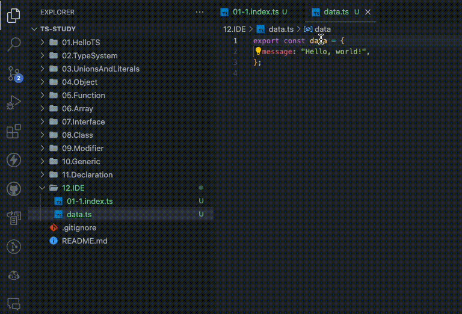

인기 있는 프로그래밍 언어는 개발 시 유용한 구문 강조와 다른 IDE 기능 없이 완성되지 않는다. 타입스크립트의 가장 큰 장점은 언어 서비스가 자바스크립트와 타입스크립트코드를 위한 강력한 개발 도우미 제품군을 제공한다는 것이다. 이 장에서는 가장 유용한 몇 가지 항목을 다룬다.

코드에서 이름을 마우스 오른쪽으로 클릭하면 사용할 수 있는 다양한 IDE 기능이 나타난다. VSCode 같은 IDE는 키보드 단축키도 함께 보여준다. IDE의 키보드 단축키에 익숙해지면 훨씬 빠르게 코드를 작성하고 리팩터링을 실행할 수 있다.

# 1. 코드 탐색

대부분의 개발자는 코드를 적극적으로 작성하는 것보다 코드를 읽는 데 훨씬 더 많은 시간을 보낸다. 따라서 코드 탐색을 지원하는 도구를 이용하면 시간을 상당히 단축할 수 있다. 타입스크립트 언어에서 제공하는 많은 기능은 코드의 타입 정의 또는 값과 코드의 사용 위치 사이를 넘나드는 등 코드 학습에 맞춰져 있다.

## 1.1 정의 찾기

타입스크립트는 타입 정의 또는 값에 대한 참조에서 시작해 코드의 원래 위치로 다시 이동할 수 있다. VSCode는 이러한 방식으로 역추적하는 몇 가지 방법을 제공한다.

- [Go to Definition](F12)은 요청된 이름이 원래 정의된 위치로 즉시 이동한다.
- [Cmd](맥) / [Ctrl](윈도우) + 이름을 클릭하면 정의된 곳으로 이동한다.
- [Peek] > [Peek Definition](Option(맥) / Alt(윈도우) + F12)은 정의를 보여주는 Peek 상자를 불러온다.

[Go to Type Definition]은 [Go to Definition]의 특수 버전으로, 값의 타입을 나타내는 정의로 이동한다. 클래스 또는 인터페이스의 인스턴스에 이 기능을 실행하는 경우에는 인스턴스가 정의된 위치를 보여주는 대신 클래스 또는 인터페이스 자체를 표시한다.

아래는 [Go to Definition]을 이용해 파일로 가져온 `data` 변수의 정의를 찾는 화면이다.

정의가 상대적인 파일과 같은 자체 코드로 선언되면 편집기는 해당 파일로 이동할 수 있도록 허락한다. npm 패키지와 같은 외부 모듈은 일반적으로 `.d.ts` 선언 파일을 사용한다.

## 1.2 참조 찾기

타입 정의 또는 값이 제공되면, 타입스크립트는 이에 대한 모든 참조 목록 또는 프로젝트에서 사용된 위치를 보여줄 수 있다. VSCode는 해당 목록을 시각화하는 몇 가지 방법을 제공한다.

[Go to Reference](Shift + F12)를 선택하면 마우스 오른쪽으로 클릭한 이름 바로 아래에 확장 가능한 Peek 상자가 나타나고, 해당 타입 정의 또는 값의 참조 목록을 보여준다.

예를 들어 아래는 `data.ts` 파일에 있는 `data` 변수 선언의 [Go to Reference] 실행 화면이고, `index.ts` 파일에서 선언과 사용법을 확인할 수 있다.

Peek 상자에서 참조 파일을 직접 볼 수 있다. 해당 파일을 입력, 편집기 명령 실행 등 마치 정기적으로 여는 파일처럼 사용할 수 있다. 파일의 Peek 상자 뷰를 더블클릭하여 해당 파일을 여는 방법도 있다.

Peek 상자의 오른쪽에 있는 파일 이름 목록을 클릭하면 Peek 상자의 파일 뷰가 클릭한 파일로 전환된다. 목록에서 파일 줄을 더블클릭하면 파일이 열리고 일치하는 참조가 선택된다.

아래와 같이 [Find All References](Option(맥) / Alt(윈도우) + Shift + F12)도 참조 목록을 보여주지만, 코드 탐색 후에도 사이드바 뷰에서 확인 가능하다. 한 번에 둘 이상의 참조를 열거나 수행하는 데 유용하다.

## 1.3 구현 찾기

[Go to Implementations](Cmd(맥) / Ctrl(윈도우) + F12)와 [Find All Implementations]는 인터페이스와 추상 클래스 메서드를 위해 만들어진 [Go To References]와 [Find All References]의 특수 버전이다.

아래와 같이 코드에서 인터페이스 또는 추상 메서드의 모든 구현을 찾는다.

이 두 메뉴는 클래스 또는 인터페이스와 같은 타입으로 입력된 값이 어떻게 사용되는지를 구체적으로 검색할 때 유용하다. [Find All References]는 클래스 또는 인터페이스에 대한 정의 및 기타 타입 참조도 보여주므로 너무 복잡해 보일 수도 있다.

# 2. 코드 작성

VSCode의 타입스크립트 서비스와 같은 IDE 언어 서비스는 편집기의 백그라운드에서 실행되고 파일에서 수행된 작업에 반응한다. IDE는 변경 내용을 파일에 저장하기도 전에 사용자가 입력한 파일의 편집 내용을 볼 수 있다. 이렇게 하면 타입스크립트 코드를 작성할 때 일반적인 작업을 자동화하는 데 도움이 되는 다양한 기능을 사용할 수 있다.

## 2.1 이름 완성하기

타입스크립트의 API를 이용하면 동일한 파일에 존재하는 이름을 자동 완성할 수 있다. 함수 인수로 이전에 선언된 변수 이름을 제공하는 것처럼 이름을 입력하기 시작하면 타입스크립트는 일치하는 이름을 가진 변수 목록으로 자동 완성을 제안한다.

아래와 같이 마우스로 목록의 이름을 클릭하거나 [Enter]를 누르면 이름이 완성된다.

패키지 의존성에 대해서도 자동 가져오기automatic import를 제공한다.
아래는 타입스크립트 코드에서 `lodash` 패키지의 `sortBy`를 가져오는 화면이다.

자동 가져오기는 타입스크립트 환경에서 가장 훌륭한 기능 중 하나이다. 자동 가져오기 기능은 자동 완성을 통해 이것이 어디에서 왔는지 파악할 수 있고, 직접 입력하는 수고로운 과정을 단축시켜준다.

## 2.2 자동 가져오기 업데이트

파일 이름을 바꾸거나 다른 폴더로 파일을 이동하는 경우 파일에 대해 잠재적으로 많은 import 문을 업데이트 해야한다. 해당 파일 자체와 이 파일을 가져오는 다른 파일 모두에서 업데이트를 수행해야한다.

VSCode 파일 탐색기를 사용해 파일을 드래그앤드롭 하거나 중첩된 폴더 경로로 이름을 바꾸면, VSCode에서 타입스크립트를 사용해 파일 경로를 업데이트하도록 제안한다.

아래는 `src/logging.ts` 파일의 이름이 `src/shared/logging.ts` 위치로 변경되고, 파일 가져오기가 이에 맞게 업데이트되는 과정이다.

## 2.3 코드 액션

타입스크립트의 많은 IDE 유틸리티는 직접 실행할 수 있는 액션action으로 제공된다. 현재 편집 중인 파일만 수정하는 액션도 있고, 한 번에 많은 파일을 수정하는 액션도 있다. 이러한 코드 액션을 사용하면 import 경로를 계산하거나 일반적인 리팩터링 같은 많은 수작업을 타입스크립트가 수행하도록 지시할 수 있다.

편집기에서 코드 액션을 사용할 수 있다면 일종의 아이콘이 나타난다. 예를 들어 VSCode에서는 아래와 같이 하나 이상의 코드 액션을 사용할 수 있는 경우 텍스트 커서 위에 클릭 가능한 전구 아이콘이 나타난다.

_VSCode의 기본 단축키는 맥에서는Cmd+.이고 윈도우에서는 Ctrl+.이다._
이름 바꾸기나 리팩터링 같은 코드 액션은 타입스크립트의 타입 시스템에서 정보를 제공하므로 특히 강력하다. 타입에 액션을 적용할 때 타입스크립트는 모든 파일에서 해당 타입의 값을 이해한 다음, 해당 값에 필요한 변경 사항을 적용한다.

### 2.3.1 이름 바꾸기

함수, 인터페이스 또는 변수의 이름처럼 이미 존재하는 이름을 수동으로 변경하는 작업은 상당히 번거롭다. 타입스크립트는 이름에 대한 모든 참조를 업데이트하는 이름 바꾸기를 수행할 수 있다.

메뉴의 [Rename Symbol](F2) 옵션을 선택하면 새 이름을 입력할 수 있는 텍스트 상자가 나타난다. 예를 들어 아래와 같이 함수 이름에서 이름 바꾸기를 실행하면 해당 함수와 해당 함수를 호출하는 모든 곳의 이름을 바꿀 수 있는 텍스트 상자가 제공된다.

새 이름을 적용하기 전에 어떤 일이 발생하는지 보려면 아래와 같이 Shift+Enter을 눌러 발생할 모든 텍스트 변경사항을 나열하는 리팩터링 미리보기 창을 연다.

### 2.3.2 사용하지 않는 코드 제거

많은 IDE는 참조되지 않은 가져온 값과 변수와 같이 사용되지 않은 코드를 시각적으로 미묘하게 다르게 나타내곤 한다. 예를 들어 VSCode는 코드의 불투명도를 1/3으로 줄여서 보여준다.

타입스크립트는 사용하지 않는 코드를 삭제하는 코드 액션을 제공한다. 아래는 사용하지 않는 `import` 문을 제거하도록 타입스크립트에 요청한 결과다.

### 2.3.3 기타 빠른 수정

타입스크립트의 오류 메세지 대부분은 키워드 또는 변수 이름 오타처럼 빠르게 수정할 수 있는 사소한 코드에 대한 내용이다. 그 외 유용한 타입스크립트의 빠른 수정 기능은 아래와 같다.

- 클래스 또는 인터페이스에서 누락된 속성 선언하기
- 잘못 입력된 필드 이름 수정하기
- 타입으로 선언된 변수의 누락된 속성 채우기

이전에 보지 못한 오류 메세지를 발견할 때마다 [Quick Fix] 목록을 확인하는 것이 좋다.
타입스크립트가 이러한 문제를 해결하기 위해 사용하는 유용한 유틸리티를 모두 알 수는 없다.

### 2.3.4 리팩터링

타입스크립트 언어 서비스는 다양한 코드 구조를 지원하는 여러 편리한 코드 변경 기능을 제공한다. 일부는 코드 줄을 이용하는 것처럼 간단하지만, 새로운 함수를 생성하는 것처럼 복잡한 기능도 있다.

코드 영역을 선택하면 VSCode는 선택된 코드 옆에 전구 아이콘을 보여준다. 리팩터링 가능한 목록을 보려면 전구 아이콘을 클릭하면 된다. 아래는 인라인 배열 티러럴에서 `const` 변수를 추출하는 과정이다.

# 3. 오류를 효과적으로 처리하기

프로그래밍 언어로 작업할 때 오류 메세지를 읽고 조치를 취하는 과정은 매우 일상적이다. 타입스크립트 언어 숙련도와는 상관없이 모든 개발자는 타입스크립트 코드를 작성할 때마다 수많은 타입스크립트 컴파일러 오류를 발생시킨다. IDE 기능을 사용해 타입스크립트 컴파일러 오류를 효과적으로 처리하는 능력을 향상시키면 훨씬 더 생산적으로 사용할 수 있다.

## 3.1 언어 서비스 오류

편집기는 타입스크립트 언어 서비스에서 보고한 모든 오류를 코드 아래 빨간 물결선으로 표시한다. 아래와 같이 물결선이 그어진 문자 위로 마우스를 가져가면 해당 문자 옆에 오류 텍스트를 담은 호버 상자가 나타난다.

VSCode는 패널 영역의 [PROBLEMS] 탭에 열려있는 모든 파일에 대한 오류도 보여준다. 오류를 나타내는 마우스 호버 정보의 왼쪽 하단 [View Problem]을 클릭하면 아래와 같이 문제가 되는 행 뒤와 후속 행 앞에 삽입된 인라인 디스플레이가 열린다.

동일한 소스 파일에 여러 문제가 있는 경우에는 아래와 같이 [View Problem] 디스플레이 우측에 있는 위쪽, 아래쪽 화살표로 오류를 전환할 수 있다. 오류를 이동하는 단축키는 F8과 Shift+F8을 사용한다.

### 3.1.1 PROBLEMS 탭

VSCode의 패널에는 이름에서 알 수 있듯이 작업 공간의 모든 문제를 나타내는 [PROBLEMS] 탭이 있다. [PROBLEMS] 탭에는 타입스크립트 언어 서비스에서 보고한 오류도 포함된다.

VSCode는 현재 열려 있는 파일에 대한 오류만 나열한다. 모든 타입스크립트 컴파일러 오류를 실시간으로 업데이트하고 싶드면 터미널에서 타입스크립트 컴파일러를 실행해야 한다.

### 3.1.2 터미널 컴파일러 실행

타입스크립트 프로젝트에서 작업하는 동안 터미널에서 타입스크립트 컴파일러 `watch` 모드(13장 구성 옵션)로 실행하는 것이 좋다. 그렇게 하면 파일에 있는 오류뿐만 아니라 모든 오류에 대한 실시간 업데이트 목록이 제공된다.

VSCode에서 이 작업을 수행하려면 터미널 패널을 엵고 `tsc -w`를 실행한다. 또는 프로젝트 참조를 사용한다면 `tsc -b -w`를 실행한다.

### 3.1.3 타입 이해

때로는 타입이 명확하지 않은 방식으로 설정된 무언가의 타입을 알아야 하는 경우가 있다. 모든 값에 대해 이름 위로 마우스를 가져가면 해당 타입을 보여주는 호버 정보가 나타난다.

아래는 변수에 대한 호버 정보를 보여준다.

이름이 선언된 위치를 표시하려면 Ctrl(Cmd)를 누른 상태로 마우스를 가져간다.

호버 상자는 타입 별칭 같은 타입에서도 사용할 수 있다. 아래는 `keyof typeof` 타입 위로 마우스를 가져가서 해당 문자열 리터럴 유니언을 확인한다.

아래는 `typeof fruits`을 리팩토링해 별도의 중개 타입을 추출한다.

