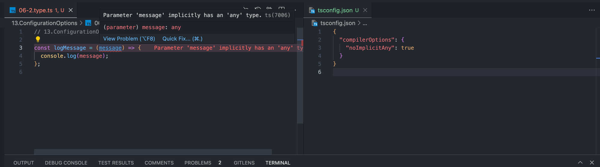

타입스크립트는 어떤 것이든 구성 가능하며 모든 일반적인 자바스크립트 사용 패턴에 맞출 수 있다. 타입스크립트는 레거시 브라우저에서부터 가장 현대적인 서버 환경까지 다양한 프로젝트에서 작동 가능하다.

타입스크립트의 구성력은 다음을 통해 제공되는 100개 이상의 풍부한 구성 옵션에서부터 비롯된다.

- `tsc`에 전달된 명령줄(CLI) 플래그
- 타입스크립트 구성 파일 TSConfig

# 1. `tsc` 옵션

`index.ts` 파일을 컴파일하기 위해 `tsc index.ts`를 사용했다. ` tsc` 명령은 타입스크립트의 대부분 옵션을 `--` 플래그로 사용할 수 있다.
예를 들어 `index.ts` 파일에서 `tsc`를 실행할 때 `index.js` 파일 생성을 건너뛰려면(타입 검사만 실행) `--noEmit` 플래그를 전달한다.

```bash
tsc index.ts --noEmit
```

`tsc --help`를 실행해 일반적으로 사용하는 CLI 플래그 목록을 가져올 수 있다. **[http://aka.ms/tsc](https://www.typescriptlang.org/docs/handbook/compiler-options.html)** 의 전체 `tsc` 구성 옵션 목록은 `tsc --all`으로 확인 가능하다.

## 1.1 `pretty` 모드

`tsc` CLI는 색상과 간격의 스타일을 지정해 가독성을 높이는 **`pretty` 모드**를 지원한다. 출력 터미널이 여러 색상 텍스트를 지원한다는 것을 감지하면 기본적으로 `pretty` 모드로 설정된다.

_여러 색상으로 출력되는 tsc_


_`--pretty false` 플래그를 제공해 간결하고 색상이 없는 형식 사용_

## 1.2 `watch` 모드

`-w`, `--watch` 모드를 사용하면 종료하는 대신 타입스크립트를 무기한 실행 상태로 유지하고 모든 오류의 실시간 목록을 가져와서 터미널을 지속적으로 업데이트 한다.


_`watch` 모드를 실행 후 에러를 보고하는 tsc_


_에러 수정 후 에러가 없음을 보고하는 tsc_

`watch` 모드는 여러 파일에 걸쳐서 리팩터링 같은 대규모 변경 작업을 할 때 특히 유용하다. 타입스크립트의 타입 오류를 일종의 체크리스트로 사용해 아직 정리해야 할 항목으로 사용할 수 있다.

# 2. TSConfig 파일

모든 파일 이름과 구성 옵션을 항상 `tsc`에 제공하는 대신, 대부분의 구성 옵션을 디렉터리의 `tsconfig.json`(TSConfig) 파일에 구체적으로 명시할 수 있다.

`tsconfig.json`의 존재는 해당 디렉터리가 타입스크립트 프로젝트의 루트임을 나타낸다. 디렉터리에서 `tsc`를 실행하면 `tsconfig.json` 파일의 모든 구성 옵션을 읽는다.

`tsc` 명령에 따라 `tsconfig.json` 파일이 있는 디렉터리 경로 또는 `tsc`가 `tsconfig.json` 대신 사용할 파일 경로를 `-p` 또는 `--project` 플러그인에 전달한다.

```bash
tsc -p path/to/tsconfig.json
```

가능하다면 타입스크립트 프로젝트에서 TSConfig 파일을 사용하기를 권장한다. VSCode 같은 IDE는 IntelliSense 기능을 제공할 때 TSConfig의 구성을 따른다. TSConfig 파일에서 사용 가능한 모든 구성 옵션 목록은 https://www.typescriptlang.org/tsconfig 를 참조.

> 💡 `tsconfig.json`에 옵션을 설정하지 않은 경우, 타입스크립트의 기본 설정이 변경되어 프로젝트의 컴파일 설정을 방해할 거라는 걱정은 접어두자. 이런 일은 거의 발생하지 않으며, 발생한다면 타입스크립트에 대한 주요 버전 업데이트가 필요하고 릴리즈 정보에서도 언급 된다.

## 2.1 `tsc --init`

`tsc` 명령줄에는 `tsconfig.json` 파일을 생성하기 위한 `--init` 명령이 포함되어 있다. 새로 생성된 TSConfig 파일에는 구성 문서에 대한 링크와 사용을 간략하게 설명하는 한 줄 주석과 함께 허용되는 대부분의 타입스크립트 구성 옵션에 대한 링크도 포함된다.

```bash
tsc --init
```

완전히 주석 처리된 `tsconfig.json` 파일이 생성된다.

```json
{
  "compilerOptions": {
    /* Visit https://aka.ms/tsconfig to read more about this file */
    // ... 생략
  }
}
```

처음 몇 번의 타입스크립트 프로젝트에서는 구성 파일을 생성하기 위해 `tsc --init`을 사용하는 것을 권장한다. 기본값은 대부분의 프로젝트에 적용 가능하고, 문서의 주석은 구성 옵션을 이해하는 데 매우 유용하다.

## 2.2 CLI vs 구성

`tsc --init`에 따라 생성된 TSConfig 파일을 살펴보면 해당 파일의 구성 옵션이 `“CompilerOptions”` 객체 내에 있다. CLI와 TSConfig 파일에서 사용 가능한 대부분의 옵션은 다음 두 가지 범주 중 하나로 분류된다.

- **컴파일러**: 포함된 각 파일이 타입스크립트에 따라 컴파일되거나 타입을 확인하는 방법
- **파일**: 타입스크립트가 실행될 파일과 실행되지 않은 파일

두 가지 범주 이후에 이야기 할 **프로젝트 레퍼런스**와 같은 다른 설정은 TSConfig 파일에서만 사용할 수 있다.

> 💡 CI 또는 프로덕션 빌드를 위한 일회성 변경과 같은 설정이 `tsc` CLI에 제공되는 경우, TSConfig 파일에 명시된 모든 값을 재정의한다. IDE는 일반적으로 타입스크립트 설정 디렉터리의 `tsconfig.json`에서 읽기 때문에 대부분의 구성 옵션을 `tsconfig.json` 파일에 넣는 것이 좋다.

# 3. 파일 포함

기본적으로 `tsc`는 현재 디렉터리와 하위 디렉터리에 있는 숨겨지지 않은 모든 `.ts` 파일에서 실행되고, 숨겨진 디렉터리와 `node_modules` 디렉터리는 무시한다. 타입스크립트 구성은 실행할 파일 목록을 수정할 수 있다.

## 3.1 `include`

파일을 포함하는 가장 흔한 방법으로 tsconfig.json의 최상위 “`include`” 속성을 사용한다. `include` 속성에 타입스크립트 컴파일에 포함할 디렉터리와 파일을 설명하는 문자열 배열을 명시한다.

예를 들어 다음 구성 파일은 `tsconfig.json`과 관련된 `src/` 디렉터리 안의 모든 타입스크립트 소스 파일을 재귀적으로 포함한다.

```json
{
  "include": ["src"]
}
```

포함할 파일을 더 세밀하게 제어하기 위해 `include` 문자열에 글로브glob 와일드카드가 허용된다.

- `*`: 0개 이상의 문자와 일치한다(디렉터리 구분자 제외).
- `?`: 하나의 문자와 일치한다(디렉터리 구분자 제외).
- `**/`: 모든 레벨에 중첩된 모든 디렉터리와 일치한다.

다음 구성 파일은 `typings/` 하위의 중첩된 디렉터리의 `.d.ts` 파일과 확장자 앞의 파일명에 적어도 두 개 이상의 문자를 가진 `src/` 하위의 파일만 허용한다.

```json
{
  "include": ["typings/**/*.d.ts", "src/**/*??.*"]
}
```

대부분의 프로젝트에서는 `[ “src” ]`와 같은 간단한 `include` 컴파일러 옵션만으로도 충분하다.

## 3.2 `exclude`

프로젝트의 `include` 파일 목록에 타입스크립트로 컴파일할 수 없는 파일이 포함되는 경우가 있다. 타입스크립트는 TSConfig 파일의 최상위 “`exclude`” 속성에 경로를 지정하고 `include`에서 경로를 생략한다. `include`처럼 타입스크립트 컴파일에서 제외할 디렉터리와 파일을 설명하는 문자열 배열이 허용된다.

다음 구성은 중첩된 `external/` 디렉터리와 `node_modules` 디렉터리 내의 모든 파일은 제외하고 src/ 내의 모든 파일을 포함한다.

```json
{
  "exclude": ["**/exteranl", "node_modules"],
  "include": ["src"]
}
```

기본적으로 `exclude`에는 컴파일리된 외부 라이브러리 파일에 대해 타입스크립트 컴파일러가 실행되지 않도록 `[ ”node_modules", “bower_components”, “jsmp_packages” ]`가 포함된다.

> 💡 자신만의 `exclude` 목록을 작성하는 경우라면 “bower_components”나 “jsmp_packages”를 다시 추가할 필요가 없다. 프로젝트 내의 폴더에 노드 모듈을 설치하는 대부분 자바스크립트 프로젝트는 “node_modules”에만 설치된다.

`exclude`는 `include`의 시작 목록에서 파일을 제거하는 작업만 수행한다. 타입스크립트는 비록 가져온 파일이 `exclude` 목록에 명시적으로 나열되어 있더라도 포함된 파일에 따라 가져온 모든 파일에서 실행된다.

# 4. 대체 확장자

타입스크립트는 기본적으로 확장자가 `.ts`인 모든 파일을 읽을 수 있다. 그러나 일부 프로젝트는 JSON 모듈 또는 리액트와 같은 UI 라이브러리를 위한 JSX 구문처럼 확장자가 다른 파일을 읽을 수 있어야 한다.

## 4.1 JSX 구문

`<Comment />` 같은 JSX 구문은 프리액트Preact와 같은 리액트 같은 UI 라이브러리에서 자주 사용한다. JSX 구문은 기술적으로 자바스크립트가 아니다. 타입스크립트의 타입 정의와 마찬가지로 자바스크립트로 컴파일되는 자바스크립트 구문의 확장이다.

```tsx
const MyComponent = () => {
  // 다음과 같은
  // return React.createElement("div", null, "Hello, World!");
  return <div>Hello, World!</div>;
};
```

파일에서 JSX 구문을 사용하기 위해서는 아래 두 가지를 수행해야 한다.
₩

- 구성 옵션에서 “`jsx`” 컴파일러 옵션을 활성화 한다.
- `.tsx` 확장자로 파일의 이름을 지정한다.

### 4.1.1 jsx

타입스크립트가 `.tsx` 파일에 대한 자바스크립트 코드를 내보내는 방법은 “jsx” 컴파일러 옵션에 사용되는 값으로 결정된다. 프로젝트는 아래 표에 있는 세 가지 값 중 하나를 사용한다.

| 값             | 입력 코드 | 출력 코드                    | 출력 파일 확장자 |
| -------------- | --------- | ---------------------------- | ---------------- |
| “preserve”     | `<div />` | `<div />`                    | .jsx             |
| “react”        | `<div />` | `React.createElement(”div”)` | .js              |
| “react-native” | `<div />` | `<div />`                    | .js              |

`jsx`에 대한 값은 tsc CLI 또는 TSConfig 파일에 제공한다.

```bash
tsc --jsx preserve
```

```bash
{
  "comilerOptions": {
    "jsx": "preserve"
  }
}
```

바벨과 같은 별도의 도구로 코드를 변환하는 것처럼 타입스크립트의 내장된 트랜스파일러를 직접적으로 사용하지 않는 경우에는 ”jsx”에 대한 허용된 값을 사용할 수 있다. Next.js 또는 Remix와 같은 최신 프레임워크로 구축된 대부분의 웹 앱은 리액트 구성 및 컴파일 구문을 처리한다. 이러한 프레임워크 중 하나를 사용하면 타입스크립트의 내장 트랜스파일러를 직접 구성할 필요가 없다.

### 4.1.2 `.tsx` 파일의 제네릭 화살표 함수

`.tsx` 파일에서 화살표 함수에 대한 타입 인수 `<T>`를 작성하려고 하면 `T` 요소의 시작 태그에 대한 종료 태그가 없기 때문에 구문 오류가 발생한다.

```tsx
const identity = <T,>(input: T) => input;
//                ^           ^ JSX element 'T' has no corresponding closing tag.
```

이런 구문 모호성ambiguity을 해결하기 위해 타입 인수에 `= unknown` 제약 조건을 추가할 수 있다. 타입 인수 기본값은 `unknown` 타입이므로 코드 동작이 전혀 변경되지 않는다. 단지 JSX 요소가 아닌 타입 인수를 읽도록 타입스크립트에 지시한다.

```tsx
const identity = <T = unknown,>(input: T) => input;
// const identity = <T extends unknown>(input: T) => input;
```

## 4.2 `resolveJsonModule`

타입스크립트는 `resolveJsonModule` 컴파일러 옵션을 `true`로 설정하면 .json 파일을 읽을 수 있다. 이렇게 하면 `.json` 파일을 마치 객체를 내보다는 `.ts` 파일인 것처럼 가져오고 해당 객체의 타입을 `const` 변수인 것처럼 유추한다.

객체가 포함된 JSON 파일이라면 구조 분해 가져오기를 사용한다. `activist.json` 파일에 `“activist”` 문자열을 정의하고 `04-3.resolveJsonModule.json` 파일에서 구조 분해 가져오기를 사용해 `“activist”`를 가져온다.

```tsx
import { activist } from "./04-3.resolveJsonModule.json";
//                       ^^^^^^^^^^^^^^^^^^^^^^^^^^^^^^^ Cannot find module './04-3.resolveJsonModule.json'. Consider using '--resolveJsonModule' to import module with '.json' extension.

console.log(activist);
```

```json
{
  "compilerOptions": {
    "resolveJsonModule": true
  }
}
```

```tsx
import { activist } from "./04-3.resolveJsonModule.json";

console.log(activist); // Logs: "Mary Astell"
```

`esModuleInterop` 컴파일러 옵션이 활성화된 경우에 기본 가져오기를 사용할 수 있다.

```json
{
  "compilerOptions": {
    "resolveJsonModule": true
  }
}
```

```tsx
import activist from "./04-3.resolveJsonModule.json";

console.log(activist); // Logs: "Mary Astell"
```

`array` 또는 `number` 같은 다른 리터럴 타입을 포함한 JSON 파일이라면 import 구문으로 `*`을 사용한다. `activists.json` 파일에 문자열 배열을 정의한 다음 `resolveJsonModule.ts` 파일에서부터 가져온다.

```json
["Ida B. Wells", "Sojourner Truth", "Tawakkul Karman"]
```

```tsx
import * as data from "./04-3.resolveJsonModule.json";

console.log(`${data.length} activists`); // Logs: "3 Activists"
```

# 5. 자바스크립트로 내보내기

바벨 같은 전용 컴파일러 도구의 등장으로 일부 프로젝트에서는 타입스크립트의 역할이 타임 검사만으로 축소되었지만, 타입스크립트 구문을 자바스크립트로 컴파일하기 위해 여전히 타입스크립트에 의존하고 있는 프로젝트도 많다. 프로젝트가 타입스크립트에 단일 의존성을 갖고, `tsc` 명령어를 사용해 자바스크립트를 출력하는 작업은 매우 유용하다.

## 5.1 `outDir`

기본적으로 타입스크립트는 출력 파일을 해당 소스 파일과 동일한 위치에 생성한다. 예를 들어 `fruits/apple.ts`와 `vegetables/zucchini.ts`가 포함된 디렉터리에서 `tsc`를 실행하면 출력파일 `fruits/apple.js`와 `vegetables/zucchini.js`가 생성된다.

```bash
fruits/
  apple.ts
  apple.js
vegetavles/
  zucchini.ts
  zucchini.js
```

경우에 따라 출력 파일을 다른 폴더에 생성하는 것이 더 나을 수도 있다. 예를 들어 노드 프로젝트는 변환된 출력 파일ㅇ르 `dist` 또는 `lib` 디렉터리에 생성한다.

타입스크립트의 `outDir` 컴파일러 옵션을 사용하면 출력 파일의 루트 디렉터리를 다르게 지정할 수 있다. 출력 파일은 입력 파일과 동일한 디렉터리 구조를 유지한다.

이전 디렉터리에서 `tsc --outDir dist`를 실행하면 다음과 같이 `dist/` 폴더 내에 출력 파일을 생성한다.

```bash
dist/
  fruits/
    apple.js
  vegetables/
    zucchini.js
fruits/
  apple.ts
vegetables/
  zucchini.ts
```

타입스크립트는 모든 입력 파일에서 가장 긴 공통 하위 경로를 찾아 출력 파일을 저장할 루트 디렉터리를 계산한다. 즉, 모든 입력 소스 파일을 단일 디렉터리에 배치하는 프로젝트는 해당 디렉터리를 루트로 처리한다.

이전 예제에서 모든 입력 파일을 `src/` 디렉터리에 넣고 `--outDir lib`로 컴파일 하면 `lib/src/fruits/apple/js` 대신 `lib/fruits/apple/js`가 생선된다.

```bash
lib/
  fruits/
    apple.js
  vegetables/
    zucchini.js
src/
  fruits/
    apple.ts
  vegetables/
    zucchini.ts
```

`rootDir` 컴파일러 옵션은 해당 루트 디렉터리를 명시적으로 지정하기 위해 존재하지만, `.` 또는 `src` 이외의 값을 사용할 일은 거의 없다.

## 5.2 `target`

타입스크립트는 ES3(1999년경)과 같은 오래된 환경에서 실행할 수 있는 자바스크립트 출력 파일을 생성할 수 있다. 또한 대부분의 환경은 자바스크립트의 최신 구문 기능을 지원한다.

타입스크립트는 자바스크립트 코드 구문을 지원하기 위해 어느 버전까지 변환해야 하는지를 지정하는 `target` 컴파일러 옵션을 제공한다. `target`을 지정하지 않으면 이전 버전과의 호환성을 위해 기본적으로 `“es3”`이 지정된다. `tsc --init`은 기본으로 `“es2016”`을 지정하도록 설정되어 있지만 대상 플랫폼에 따라 가능한 한 최신 자바스크립트 구문을 사용하는 것이 좋다. 오래된 환경에서 최신 자바스크립트 기능을 지원하려면 더 많은 자바스크립트 코드를 생성해야 하므로, 파일 크기가 조금 더 커지고 런타임 성능이 조금 저하된다.

> 💡 2022년에는 전 세계의 사용자의 0.1% 이상을 서비스하는 브라우저의 모든 배포 버전은 최소한 모든 ECMAScript2019와 거의 모든 ECMAScript2020~2021을 지원한다. 또한 LTS 지원 버전의 Node.js는 모든 ECMAScript 2021을 지원한다. 그러므로 `target`을 적어도 `“es2019”` 이상으로 지정하지 않을 이유가 없다.

다음 타입스크립트 소스는 ES2015의 `const`와 ES2020의 nullish 병합 연산자인 `??`를 포함한다.

```tsx
function defaultNameAndLog(nameMaybe: string | undefined) {
  const name = nameMaybe ?? "anonymous";
  console.log("From", nameMaybe, "to", name);
  return name;
}
```

`tsc --target es2020` 이상을 사용하면 `const`와 `??`는 지원되는 구문 기능이므로 타입스크립트는 코드에서 `: string | undefined`만 제거하면 된다.

```bash
tsc 13.ConfigurationOptions/05-1.target.ts --target es2020
```

```jsx
function defaultNameAndLog(nameMaybe) {
  const name = nameMaybe ?? "anonymous";
  console.log("From", nameMaybe, "to", name);
  return name;
}
```

`tsc --target es2015`에서 es2019를 사용하면, `??` 구문은 이전 버전의 자바스크립트에서 상응되는 코드로 컴파일 된다.

```bash
tsc 13.ConfigurationOptions/05-1.target.ts --target es2015
```

```jsx
function defaultNameAndLog(nameMaybe) {
  const name =
    nameMaybe !== null && nameMaybe !== void 0 ? nameMaybe : "anonymous";
  console.log("From", nameMaybe, "to", name);
  return name;
}
```

`tsc --target es3` 또는 `es5`를 사용하면, `const`는 추가적으로 `const`에 사응하는 `var`로 변환해야 한다.

```bash
tsc 13.ConfigurationOptions/05-1.target.ts --target es3
```

```jsx
function defaultNameAndLog(nameMaybe) {
  var name =
    nameMaybe !== null && nameMaybe !== void 0 ? nameMaybe : "anonymous";
  console.log("From", nameMaybe, "to", name);
  return name;
}
```

`target` 컴파일러 옵션을 코드가 실행될 수 있는 가장 오래된 환경의 값으로 지정하면 코드가 구문 오류 없이 여전히 실행 가능한 현대적이고 간결한 구문으로 내보내진다.

## 5.3 내보내기 선언

대부분의 패키지는 타입스크립트의 `declaration` 컴파일러 옵션을 사용해 소스 파일에서 `.d.ts` 출력 파일을 내보낸다.

```bash
tsc --declaration
```

```bash
{
	"compilerOptions": {
		"declaration": true
	}
}
```

`.d.ts` 출력 파일은 `outDir` 옵션에 따라 `.js` 파일과 동일한 출력 규칙에 따라 내보내진다.

예를 들어 `fruits/apple.ts`와 `vegetables/zucchini.ts`가 있는 디렉터리에서 `tsc -declaration`을 실행하면 출력 `.js` 파일과 함께 `fruits/apple.d.ts`와 `vegetables/zucchini.d.ts` 출력 선언 파일이 생성된다.

```bash
fruits/
  apple.d.ts
  apple.js
  apple.ts
vegetables/
  zucchini.d.ts
  zucchini.js
  zucchini.ts
```

### 5.3.1 `emitDeclarationOnly`

`declaration` 컴파일러 옵션에 대한 특별한 추가로 타입스크립트가 `.js`와 `.jsx` 파일 없이 선언 파일만 내보내도록 지시하는 `emitDeclarationOnly` 컴파일러 옵션이 존재한다. 이는 외부 도구를 사용해 출력 자바스크립트를 생성하지만 여전히 타입스크립트를 사용해 출력 선언 파일을 생성하려는 프로젝트에 유용하다.

```bash
tsx --emitDeclarationOnly
```

```json
{
  "compilerOptions": {
    "emitDeclarationOnly": true
  }
}
```

`emitDeclarationOnly`가 활성화 된 경우 `declraration` 또는 `composite` 컴파일러 옵션을 활성화 해야한다.

예를 들어 `frutis/apple.ts`와 `vegetabales/zucchini.ts`가 있는 디렉터리에서 `tsc --declaration -emitDeclarationOnly`를 실행하면 출력 `.js` 파일 없이 `fruits/apple.d.ts`와 `vegetabales/zucchini.d.ts` 출력 선언 파일이 생성된다.

```bash
fruits/
  apple.d.ts
  apple.ts
vegetables/
  zucchini.d.ts
  zucchini.ts
```

## 5.4 소스맵

소스 맵source map은 출력 파일의 내용이 원본 소스파일과 어떻게 일치하는지에 대한 설명이다. 소스 맵은 출력 파일을 탐색할 때 디버거 같은 개발자 도구에서 원본 소스 코드를 표시하도록 설정한다. 브라우저 개발자 도구와 IDE에서 디버깅하는 동안 원본 소스 파일 내용을 볼 수 있도록 하는 시각적인 디버거에 특히 소스 맵이 유용하다. 타입스크립트는 출력 파일과 함께 소스 맵을 출력하는 기능도 제공한다.

### 5.4.1 `sourceMap`

타입스크립트의 `sourceMap` 컴파일러 옵션을 사용하면 `.js` 또는 `.jsx` 출력 파일과 함께 `.js.map` 또는 `.jsx.map` 소스 맵을 출력할 수 있다. 그렇지 않으면 소스 맵이 파일에 해당 출력 자바스크립트 파일과 동일한 이름으로 동일한 디렉터리에 생성된다.

`frutis/apple.ts`와 `vegetabales/zucchini.ts`가 있는 디렉터리에서 `tsc --sourceMap`을 실행하면 출력 `.js` 파일과 함께 `frutis/apple.js.map`과 `vegetabales/zucchini.js.map` 출력 소스 맵 파일이 생성된다.

```bash
fruits/
  apple.js
  apple.js.map
  apple.ts
vegetables/
  zucchini.js
  zucchini.js.map
  zucchini.ts
```

### 5.4.2 `declarationMap`

타입스크립트는 `.d.ts` 선언 파일에 대한 소스 맵을 생성할 수도 있다. `declarationMap` 컴파일러 옵션은 원본 소스 파일에 해당하는 각 `.d.ts`에 대한 `.d.ts.map` 소스 맵을 생성하도록 지시한다. `declarationMap`을 활성화하면 VSCode 같은 IDE에서 [Go to Definition] 기능으로 원본 소스 파일로 이동할 수 있다.

> 💡 `declarationMap`은 프로젝트 레퍼런스를 작업할 때 유용하다.

`frutis/apple.ts`와 `vegetabales/zucchini.ts`가 있는 디렉터리에서 `tsc --declaration --declarationMap`을 실행하면 출력 .d.ts와 .js 파일과 함께 `frutis/apple.d.ts.map`과 `vegetabales/zucchini.d.ts.map` 출력 선언 소스 맵 파일이 생성된다.

```bash
fruits/
  apple.d.ts
  apple.d.ts.map
  apple.js
  apple.ts
vegetables/
  zucchini.d.ts
  zucchini.d.ts.map
  zucchini.js
  zucchini.ts
```

## 5.5 `noEmit`

다른 도구를 이용해 소스 파일을 컴파일하고, 자바스크립트를 출력하는 프로젝트에서 타입스크립트는 파일 생성을 모두 건너뛰도록 지시할 수 있다. `noEmit` 컴파일러 옵션을 활성화 하면 타입스크립트가 온전히 타입 검사기로만 작동한다.

이전 예제 모두에서 `tsc --noEmit`을 실행하면 어떠한 파일도 생성되지 않는다. 타입스크립트는 발견한 구문 또는 타입 오류만을 보고한다.

# 6. 타입 검사

대부분의 타입스크립트 구성 옵션은 타입 검사기를 제어한다. 구성 옵션을 느슨하게 구성해 오류가 완전히 확실할 때만 타입 검사 오류를 보고하도록 하거나, 구성 옵션을 엄격하게 구성해 거의 모든 코드를 올바르게 잘 입력하도록 요구할 수 있다.

## 6.1 `lib`

먼저 타입스크립트가 런타임 환경에 있다고 가정하는 전역 API는 `lib` 컴파일러 옵션으로 구성할 수 있다. `lib` 컴파일러 옵션은 브라우저 타입 포함을 나타내는 `dom`과 `target` 컴파일러 옵션을 기본값으로 하는 문자열 배열을 사용한다.

`lib` 설정을 변경하는 유일한 이유는 브라우저에서 실행되지 않는 프로젝트에서 기본으로 포함된 `dom`을 제거하기 위함이다.

```bash
tsc --lib es2020
```

```json
{
  "compilerOptions": {
    "lib": ["es2020"]
  }
}
```

또는 최신 자바스크립트 API를 지원하기 위해 폴리필polyfill을 사용하는 프로젝트에서 `lib` 컴파일러 옵션을 사용해 `dom`과 ECMAScript 특정 버전을 포함할 수 있다.

```bash
tsc --lib dom,es2021
```

```json
{
  "compilerOptions": {
    "lib": ["dom", "es2021"]
  }
}
```

올바른 런타임 폴리필을 모두 제공하지 않는 상태에서는 `lib`을 수정하지 않도록 주의하자. ES2020까지만 지원하는 플랫폼에서 실행되는 `lib`이 “es2021”로 설정된 프로젝트에서는 타입 검사 오류가 없을 수 있지만 `String.replaceAll`과 같이 ES2021 이상에 정의된 API를 사용하려고 하면 여전히 런타임 오류가 발생할 수 있다.

```tsx
const value = "a b c";

value.replaceAll(" ", ", "); // Error
```


> 💡 `lib` 컴파일러 옵션은 내장된 언어 API를 나타내는 데 사용하고, `target` 컴파일러 옵션은 존재하는 구문 기능을 나타내는 데 사용한다.

## 6.2 `skipLibCheck`

타입스크립트는 소스 코드에 명시적으로 포함되지 않은 선언 파일에서 타입 검사를 건너뛰도록 하는 `skipLibCheck` 컴파일러 옵션을 제공한다. `skipLibCheck` 옵션은 공유된 라이브러리의 정의가 서로 다르고 충돌할 수 있는 패키지 의존성을 많이 사용하는 애플리케이션에 유용하다.

```bash
tsc --skipLibCheck
```

```json
{
  "compilerOptions": {
    "skipLibCheck": true
  }
}
```

`skipLibCheck`는 타입 검사 일부를 건너뛰는 작업으로 타입스크립트 성능을 개선한다. 따라서 대부분의 프로젝트에서 `skipLibCheck` 옵션을 활성화하는 것이 좋다.

## 6.3 엄격 모드

타입스크립트의 타입 검사 컴파일러 옵션 대부분은 타입스크립트의 **엄격 모드**strict mode로 그룹화된다. 엄격한 컴파일러 옵션은 기본적으로 `false`이고, 활성화 되면 타입 검사기에 일부 추가적인 검사를 켜도록 지시한다.

엄격 옵션 중에 `noImplicitAny`와 `stringNullChecks`는 타입 안전 코드를 적용하는 데 특히 유용하고 영향력이 있다.

`strict` 컴파일러 옵션을 활성화 하면 모든 엄격 모드 검사가 활성화 된다.

```bash
tsc --strict
```

```json
{
  "compilerOptions": {
    "strict": true
  }
}
```

특정 검사를 제외한 모든 엄격 모드 검사를 활성화 하고 싶다면 `strict`를 활성화 하고 특정 검사를 명시적으로 비활성화 할 수 있다. 다음 구성은 `noImplicitAny`를 제외한 모든 엄격 모드를 활성화 한다.

```bash
tsc --strict --noImplicitAny false
```

```json
{
  "compilerOptions": {
    "noImplicitAny": false,
    "strict": true
  }
}
```

> 💡 타입스크립트의 향후 버전에서는 strict 아래에 새로운 엄격 타입 검사 컴파일러 옵션을 도입할 수도 있다. 그러므로 strict를 사용하면 타입스크립트 버전을 업데이트할 때 새로운 타입 검사 오류가 발생할 수 있다. TSConfig에서 특정 설정을 언제든지 해제할 수 있다.

### 6.3.1 `noImplicitAny`

타입스크립트가 매개변수 또는 속성의 타입을 유추할 수 없는 경우라면 `any` 타입으로 가정한다. `any` 타입은 타입스크립트의 타입 검사를 대부분 우회할 수 있으므로 코드에서 이러한 암시적 타입을 허용하지 않아야한다.

`noImplicitAny` 컴파일러 옵션은 암시적 `any`로 대체될 때 타입스크립트에 타입 검사 오류가 발생하도록 지시한다.

타입 선언이 없는 다음 함수 매개변수는 `noImplicitAny`에서 타입 오류를 발생시킨다.

```tsx
const logMessage = (message) => {
  //                ^^^^^^^ Error: Parameter 'message' implicitly has an 'any' type.
  console.log(message);
};
```

`noImplicitAny` 오류는 오류가 발생한 위치에 타입 애너테이션을 추가하면 대부분 해결된다.

```tsx
const logMessage = (message: string) => {
  console.log(message);
};
```



또는 함수 매개변수의 경우, 함수의 타입을 나타내는 위치에 부모 함수를 배치한다.

```tsx
type LogsMessage = (message: string) => void;

const logMessage: LogsMessage = (message) => {
  console.log(message);
};
```

> 💡 `noImplicitAny`는 프로젝트 전체에서 타입 안정성을 보장하는 훌륭한 플래그다. 완전히 타입스크립트로만 작성된 프로젝트에서는 이 기능을 사용하는 것이 매우 좋다. 그러나 프로젝트가 여전히 자바스크립트에서 타입스크립트로 전환 중인 경우라면 먼저 모든 파일을 타입스크립트로 변환하는 것이 더 쉬울 수도 있다.

### 6.3.2 `strictBindCallApply`

타입스크립트가 처음 출시되었을 때 내장된 `Function.apply`, `Function.bind`, `Function.call` 함수 유틸리티를 나타낼 수 있을 만큼 충분한 타입 시스템 기능이 없었다. 기본적으로 이런 함수는 함수의 인수 목록에 대해 `any`를 사용해야 했고 타입 안정성과는 매우 거리가 먼 상태였다.

예를 들어 `strictBindCallApply`가 없으면 다음 `getLength` 함수의 변형은 모두 해당 타입에 `any`를 포함한다.

```tsx
function getLength(text: string, trim?: boolean) {
  return trim ? text.trim().length : text.length;
}

// 타입: (thisArg: Function, argArray?: any) => any
const result3_1 = getLength.apply;

// 타입: any
const result3_2 = getLength.bind(undefined, "abc123");

// 타입: any
const result3_3 = getLength.call(undefined, "abc123", true);
```

이제 타입스크립트의 타입 시스템 기능은 이러한 함수의 제네릭 나머지 인수를 나타내기에 충분히 강력하고 함수애 더 제한적인 타입 사용을 허용한다.

`strictBindCallApply`를 활성화하면 `getLength` 함수 변형에 대해 훨씬 더 정확한 타입을 사용할 수 있다.

```json
{
  "compilerOptions": {
    "strictBindCallApply": true
  }
}
```

```tsx
function getLength(text: string, trim?: boolean) {
  return trim ? text.trim().length : text;
}

// 함수 타입: (thisArg: typeof getLength, args: [text: string, trim?: boolean]) => number;
getLength.apply;

// 반환 타입: (trim?: boolean) => number
getLength.bind(undefined, "abc123");

// 반환 타입: number
getLength.call(undefined, "abc123", true);
```

타입스크립트의 모범 사례는 `strictBindCallApply`를 활성화하는 것이다. 내장된 함수 유틸리티에 대한 개선된 타입 검사는 이를 활용하는 프로젝트의 타입 안정성을 개선하는 데 도움이 된다.

### 6.3.3 `strictFunctionTypes`

`strictFunctionTypes` 컴파일러 옵션은 함수 매개변수 타입을 약간 더 엄격하게 검사한다. 매개변수가 다른 타입의 매개변수 하위 타입인 경우 함수 타입은 더 이상 다른 함수 타입에 할당 가능한 것으로 간주되지 않는다.

다음 `checkNumber` 함수는 `number | string`을 받는 함수를 사용해야 하지만, 오직 타입이 `string`인 매개변수만 받을 것으로 예상하는 `stringContainsA` 함수가 제공된다. 타입스크립트의 기본 타입 검사는 `stringContainsA` 함수가 제공되는 것을 허용하고, 프로그램은 매개변수가 `number`인 경우 `.match()`를 호출하려고 하면 문제가 발생한다.

```tsx
function checkOnNumber(constainsA: (input: number | string) => boolean) {
  return constainsA(1337);
}

function stringContainsA(input: string) {
  return !!input.match(/a/i);
}

checkOnNumber(stringContainsA);
```

`strictFunctionTypes`가 적용된 상태에서 `checkOnNumber(stringContainsA)`는 타입 검사 오류를 발생시킨다.

```json
{
  "compilerOptions": {
    "strictFunctionTypes": true
  }
}
```

```tsx
function checkOnNumber(constainsA: (input: number | string) => boolean) {
  return constainsA(1337);
}

function stringContainsA(input: string) {
  return !!input.match(/a/i);
}

checkOnNumber(stringContainsA);
//            ^^^^^^^^^^^^^^^ Argument of type '(input: string) => boolean' is not assignable to parameter of type '(input: string | number) => boolean'.
//                            Types of parameters 'input' and 'input' are incompatible.
//                            Type 'string | number' is not assignable to type 'string'.
//                            Type 'number' is not assignable to type 'string'.
```

> 💡 기술적인 측면에서 함수 매개변수는 bivariant에서 contracariant로 전환된다. 이 차이점에 대해서는 타입스크립트 [2.6 릴리스 노트](https://www.typescriptlang.org/docs/handbook/release-notes/typescript-2-6.html)에서 확인할 수 있다.

### 6.3.4 `strictNullChecks`

타입스크립트의 `strictNullChecks` 플래그를 비활성화 하면 코드의 모든 타입에 `null | undefined`가 추가되고, 모든 변수가 `null` 또는 `undefined`를 받을 수 있도록 허용한다.

아래 코드는 `strictNullChecks`를 활성화한 경우, `string` 타입인 `value`에 `null`을 할당하면 타입 오류가 발생한다.

```json
{
  "compilerOptions": {
    "strictNullChecks": true
  }
}
```

```tsx
let strictValue: string;

strictValue = "Hello World"; // ok

strictValue = null;
//^^^^^^^^^ Type 'null' is not assignable to type 'string'.
```

타입스크립트의 모범 사례는 `strictNullChecks`를 활성화하는 것이다. 이렇게 하면 충돌을 방지하고 십억 달러의 실수를 제거하는 데 매우 유용하다.

### 6.3.5 `strictPropertyInitialization`

타입스크립트의 `strictPropertyInitialization` 플래그는 초기화가 없고, 생성자에 확실하게 할당되지 않은 클래스 속성에서 타입 오류를 발생시킨다.

타입스크립트의 모범 사례는 `strictPropertyInitialization`를 활성화하는 것이다. 이렇게 하면 클래스 초기화 로직 실수로 인한 충돌을 방지할 수 있다.

### 6.3.6 `useUnknownInCatchVariables`

모든 언어에서 오류 처리는 본질적으로 안전하지 않은 개념이다. 이론적으로 모든 함수는 사용자가 작성한 `throw` 문이나 `undefined`에서 속성을 읽는 것과 같은 극단적인 경우에 여러 오류를 발생시킨다. 사실 발생한 오류가 `Error` 클래스의 인스턴스라는 보장은 없다. 코드는 항상 “다른 무언가”를 `throw`할 수 있다.

오류는 그 어떤 것도 될 수 있으므로 타입스크립트는 오류의 기본 동작으로 `any` 타입을 제공한다. 기본적으로 타입이 안전하지 않은 `any`에 의존하는 비용으로 오류 처리에 대한 유연성을 허용한다.

아래 코드의 `error`는 타입스크립트가 `someExternalFunction()`에서 발생 가능한 모든 오류를 알 수 있는 방법이 없기 때문에 타입이 `any`가 된다.

```tsx
try {
  someExternalFunction();
} catch (error) {
  error; // 기본타입: any
}
```

대부분의 any 사용과 마찬가지로 오류를 억지로 명시적 타입 어서션 또는 내로잉하는 비용보다 unknown으로 처리하는 것이 기술적으로 더 타당하다. catch 절의 오류는 any 또는 unknown 타입으로 애너테이션을 추가할 수 있다.

아래 코드는 error에 명시적으로 : unknown을 추가해 error를 unknown 타입으로 전환한다.

```tsx
try {
  someExternalFunction();
} catch (error: unknown) {
  error; // 기본타입: unknown
}
```

엄격한 영역 플래그인 `useUnknownInCatchVariables`는 타입스크립트의 기본 `catch` 절 `error` 타입을 `unknown`으로 변경한다. `useUnknownInCatchVariables`를 활성화하면 앞서 살펴본 두 개의 코드에서 `error` 타입은 `unknown`으로 설정된다.

타입스크립트의 모범 사례는 `useUnknownInCatchVariables`를 활성화 하는 것이다. 왜냐하면 오류가 특정 타입이 될 수 있는 것으로 가정하는 것이 언제나 안전하지는 않기 때문이다.

# 7. 모듈

AMD, CommonJS, ECMAScript 등 모듈 내용을 내보내고 가져오기 위한 자바스크립트의 다양한 시스템은 최신 프로그래밍 언어에서 가장 복잡한 모듈 시스템이다. 자바스크립트는 파일이 서로의 콘텐츠를 가져오는 방식이 웹팩과 같은 사용자 작성 프레임워크에 따라 구동되는 경우가 많다는 점에서 상대적으로 특이하다. 타입스크립트는 가장 합리적인 사용자 영역 모듈 구성을 나타내내는 구성 옵션을 제공하기 위해 최선을 다한다.

새로운 타입스크립트 프로젝트 대부분은 표준화된 ECMAScript 모듈 구문으로 작성된다. 요약하자면 ECMAScript 모듈이 다른 모듈(”my-example-lib”)에서 값(value)을 가져오고, 자체 값(logValue)을 내보내는 방법은 아래와 같다.

```tsx
import { value } from "my-example-lib";

export const logValue = () => console.log(value);
```

## 7.1 `module`

타입스크립트는 어떤 모듈 시스템으로 변환된 코드를 사용할지 결정하기 위해 `module` 컴파일러 옵션을 제공한다.

타입스크립트는 어떤 모듈 시스템으로 변환된 코드를 사용할지 결정하기 위해 `module` 컴파일러 옵션을 제공한다. ECMAScript 모듈로 소스 코드를 작성할 때 타입스크립트는 `module` 값에 따라 `export`와 `import` 문을 다른 모듈 시스템으로 변환할 수 있다.
예를 들어 ECMAScript로 작성된 프로젝트는 다음 명령줄을 사용해서 CommonJS 모듈로 출력되도록 지시한다.

```tsx
tsc --module commonjs
```

또는 TSConfig에 다음과 같이 `module` 컴파일러 옵션을 추가해서 CommonJS 모듈로 출력되도록 한다.

```json
{
  "compilerOptions": {
    "module": "commonjs"
  }
}
```

이전 코드는 아래와 같이 출력된다.

```tsx
const my_example_lib = require("my_example_lib");
exports.logValue = () => console.log(my_example_lib.value);
```

`target` 컴파일러 옵션이 `"es3"` 또는 `"es5"`인 경우 `module` 컴파일러 옵션의 기본값은 `"commonjs"`가 된다. 그렇지 않으면 ECMAScript 모듈로 출력하도록 지정하기 위해 `module` 컴파일러 옵션은 `"es2015"`로 기본 설정된다.

## 7.2 `moduleResolution`

모듈 해석`moduleResolution`은 `import`에서 가져온 경로가 `module`에 매핑되는 과정이다. 타입스크립트는 해당 과정에 로직을 지정하는 데 사용할 수 있는 `moduleResolution` 옵션을 제공합 니다. 일반적으로 다음 두 가지 로직 전략 중 하나를 제공하는 것을 선호합니다.

- `node` : 기존 Nodejs와 같은 `CommonJS` 리졸버resover에서 사용하는 동작
- `nodenext` : ECMA스크립트 모듈에 대해 지정된 동작에 맞게 조정

두 전략은 유사하며 대부분의 프로젝트는 둘 중 하나를 사용할 수 있으며 차이를 느끼지 못한다. https://www.typescriptlang.org/docs/handbook/modules/theory.html#module-resolution에서 모듈 해석 이면에 있는 복잡성에 대해 자세히 알아볼 수 있다.

> 💡 `moduleResolution`은 타입스크립트가 코드를 내보내느 방법을 전혀 변경하지 않는다. 따라서 코드가 실행되는 런타임 환경을 설명하기 위해서만 사용된다.

아래 CLI 코드와 JSON 파일 코드 모두 `moduleResolution` 컴파일러 옵션을 지정한다.

```tsx
tsc --moduleResolution nodenext
```

```json
{
  "compilerOptions": {
    "moduleResolution": "nodenext"
  }
}
```

> 💡 이전 버전과의 호환성을 위해 타입스크립트는 기본 moduleResolution 값을 수년 전의 프로젝트에 사용된 클래식 값으로 유지한다. 어떠한 최신 프로젝트에서도 클래식한 전략을 원하지 않을 것이다.

## 7.3 CommonJs와의 상호 운용성

자바스크립트 모듈로 작업할 때 모듈의 **기본default** 내보내기와 **네임스페이스namespace** 출력 간에는 차이점이 있다. 모듈의 기본 내보내기는 내보낸 객체의 **.default 속성**이다. 모듈의 네임스페이스 내보내기는 내보낸 **객체 자체**이다.

아래 표는 기본과 네임스페이스 내보내기와 가져오기 간의 차이점이다.

| 구문 영역             | CommonJS                                  | ECMAScript Module            |
| --------------------- | ----------------------------------------- | ---------------------------- |
| 기본 내보내기         | `module.exports.default = value`          | `export default value;`      |
| 기본 가져오기         | `const { default: value } = require(”…”)` | `import value from “…”`      |
| 네임스페이스 내보내기 | `module.exports = value`                  | 지원 안함                    |
| 네임스페이스 가져오기 | `const value = require(”…”)`              | `import * as value from “…”` |

타입스크립트의 타입 시스템은 ECMAScript 모듈 측면에서 파일 가져오기와 내보내기에 대한 합의를 만든다. 그러나 대부분의 프로젝트처럼npm 패키지에 의존하는 경우 의존성 중 일부는 여전히 CommonJS 모듈로 배포된다. 또한 ECMAScript 모듈 규칙을 준수하는 일부 패키지는 비록 기본 내보내기를 포함하지 않지만, 많은 개발자는 네임스페이스 가져오기보다 간결한 기본 가져오기를 선호한다. 타입스크립트에는 모듈 형식 간의 상호 운용 성을 개선하는 몇 가지 컴파일러 옵션을 제공합니다.

### 7.3.1 `esModuleInterop`

`esModuleInterop` 구성 옵션은 module이 "es2015" 또는 "esnext"와 같은 ECMAScript 모듈 형식이 아닌 경우 타입스크립트에서 내보낸 자바스크립트 코드에 소량의 로직을 추가다. 해당 로직은 ECMAScript 모듈이 기본 또는 네임스페이스 가져오기에 대한 ECMAScript 모듈의 규칙을 준수하지 않는 경우에도 모듈에서 가져올 수 있도록 한다.
`esModuleInterop`을 활성화하는 이유 중 하나는 기본 내보내기를 제공하지 않는 "react" 같 은 패키지를 위해서다. 모듈이 "react" 패키지에서 기본 가져오기를 사용하려고 하면 타입스크립트는 `esModuleInterop`이 활성화되지 않은 것에 대한 타입 오류를 보고한다.

```tsx
import React from "react";
//     ^^^^^
// Error: Module '"file:///node_module/@types/react/index"' can only be default-imported using the 'esModuleInterop' flag.
```

`esModuleInterop`은 내보낸 자바스크립트 코드가 가져오기로 작동하는 방식에 대해서만 직접 변경한다.
다음 `allowSyntheticDefaultImports` 구성 옵션은 타입 시스템에 가져오기 상호 운영성을 알리는 옵션이다.

### 7.3.2 `allowSyntheticDefaultImports`

`allowSyntheticDefaultImports` 컴파일러 옵션은 ECMAScript 모듈이 호환되지 않는 CommonJS 네임스페이스 내보내기 파일에서 기본 가져오기를 할 수 있음을 타입 시스템에 알린다.
`allowSyntheticDefaultImports` 컴파일러 옵션은 다음 중 하나가 true인 경우에만 true로 기본적으로 설정됩니다.

- module "system"인 경우(이 책에서 다루지 않는 오래되고 거의 사용하지 않는 모듈 형식)
- `esModuleInterop` true이고 module "es2015" 또는 "esnext"와 같은 ECMAScript 모듈 형
  식이 아닌 경우

즉, `esModuleInterop`이 true 지만 module이 “esnext”인 경우 타입스크립트는 컴파일된 출력 자바스크립트 코드가 가져오기 상호 운영성 지원을 사용하지 않는다고 가정한다.

```tsx
import React from "react";
//     ^^^^^
// Error: Module '"file:///node_module/@types/react/index"' can only be default-imported using the 'allowSyntheticDefaultImports' flag.
```

## 7.4 `isolatedModules`

한 번에 하나의 파일에서만 작동하는 바벨과 같은 외부 트랜스파일러는 타입 시스템 정보를 사 용해 자바스크립트를 내보낼 수 없다. 결과적으로 타입 정보에 의존하며 자바스크립트를 내보내는 타입스크립트 구문 기능은 바벨 같은 트랜스파일러에서는 지원되지 않는다.

- `const` 열거형
- 스크립트(모듈이 아닌) 파일
- 독립 실행형 타입 내보내기

프로젝트에서 타입스크립트가 아닌 다른 도구를 사용해 자바스크립트로 변환하는 경우에는 `isolatedModules`를 활성화하는 것이 좋다.

# 8. 자바스크립트

모든 소스 파일을 타입스크립트로 작성할 필요는 없다. 타입스크립트는 기본적으로 `.js` 또는 `.jsx` 확장자를 가진 파일을 무시하지만, `allowJs`와 `checkJs` 컴파일러 옵션을 사용하면 자바스크립트 파일을 읽고, 컴파일하고, 제한된 기능이지만 타입 검사도 할 수 있다.

> 💡 기존 자바스크립트 프로젝트를 타입스크립트로 변환하는 일반적인 전략은 처음에 타입스크립트로 변 환된 몇 개의 파일만으로 시작하는 것이다. 시간이 지남에 따라 자바스크립트 파일이 더 이상 남지 않을 때 까지 더 많은 파일이 추가될 수 있다. 준비가 될 때까지 타입스크립트에 올인할 필요는 없다!

## 8.1 `allowJs`

`allowJs` 컴파일러 옵션은 자바스크립트 파일에 선언된 구문을 타입스크립트 파일에서 타입 검사를 하도록 허용한다. `jsx` 컴파일러 옵션과 결합하면 `.jsx` 파일도 검사할 수 있다.

아래 index.ts는 value.js 파일에 선언된 `value`를 가져온다.

```tsx
export const value = "We cannot succed when half of us are held back.";
```

```tsx
import { value } from "./06-6.value.js";

console.log(value);
```

`allowJs`가 활성화되지 않으면 `import` 문을 알려진 타입을 갖지 못한다. 기본적으로 암시적 `any`가 되거나 `“Could not find a declaration file for module './06-6.value.js'.”`와 같은 타입 오류가 발생한다.

또한 `allowJs`는 ECMAScript `target`에 맞게 컴파일되고 자바스크립트로 내보내진 파일 목록에 자바스크립트 파일을 추가한다. `allowJs`` 옵션이 활성화 된 경우 소스 맵과 선언 파일도 생성된다.

```tsx
tsc --allowJs
```

```tsx
{
  "compilerOptions": {
    "allowJs": true
  }
}
```

`allowJs`가 활성화되면 가져온 `value`는 `string` 타입이 된다. 그리고 아무런 오류도 발생하지 않는다.

## 8.2 `checkJs`

타입스크립트는 단순히 자바스크립트 파일을 타입 검사할 수 있도록 타입스크립트 파일로 변환하는 것 이상을 수행할 수 있다. 자바스크립트 파일도 타입 검사가 가능하다. `checkJs` 컴파일러 옵션은 다음 두 가지 용도로 사용된다.

- `allowJs` 옵션이 아직 `true`가 아니라면 기본 값을 `true`로 설정하기
- .js와 .jsx 파일에서 타입 검사기 활성화 하기

`checkJs`를 활성화 하면 타입스크립트가 자바스크립트 파일을 타입스크립트 관련 구문이 없는 타입스크립트 파일인 것처럼 처리한다. 타입 불일치, 철자가 틀린 변수명 등 타입스크립트 파일에서 일반적으로 발생하는 모든 오류를 발생시킬 수 있다.

```tsx
tsc --checkJs
```

```tsx
{
  "compilerOptions": {
    "checkJs": true
  }
}
```

`checkJs`가 활성화 되면 다음 자바스크립트 파일은 잘못된 변수명에 대한 타입 오류가 발생한다.

```tsx
// 13.ConfigurationOptions/06-7.checkJs.ts

let myQuotes = "Each person must live their life as a model for others.";

console.log(mQuotes);
//          ^^^^^^^ Cannot find name 'mQuotes'. Did you mean 'myQuotes'?
```

`checkJs`가 활성화 되지 않았다면 타입스크립트는 해당 버그에 대한 오류를 보고하지 않는다.

### 8.2.1 `@ts-check`

파일 상단에 `// @ts-chek` 주석을 사용해 파일별로 `checkJs`를 활성화 한다. 이 작업으로 해당 자바스크립트 파일에 대해서만 `checkJs` 옵션이 활성화 된다.

```tsx
// @ts-check
let myQuotes = "Each person must live their life as a model for others.";

console.log(mQuotes);
//          ^^^^^^^ Cannot find name 'mQuotes'. Did you mean 'myQuotes'?
```

## 8.3 JSDoc 지원

자바스크립트에는 타입스크립트의 풍부한 타입 구문이 없기 때문에 자바스크립트 파일에 선언된 값의 타입은 종종 타입스크립트 파일에 선언된 값만큼 명확하지 않다. 예를 들어 타입스크립트는 자바스크립트 파일에서 변수로 선언된 객체의 값을 유추할 수 있지만, 해당 파일에서 그 값이 특정 인터페이스에 적용된다고 선언하는 고유한 자바스크립트 방법은 없다.

`allowJs`와 `checkJs`가 활성화 되면 타입스크립트는 코드의 모든 JSDoc 정의를 인식한다.

아래 코드는 `string` 타입을 받는 ` sesntenceCase` 함수에 대한 JSDoc을 선언한다. 그러면 타입스크립트는 해당 함수가 `string`을 반환한다고 유추한다. `chekJs`가 활성화 되면 타입스크립트는 `string[]`을 전달하는 것에 대해서는 타입 오류가 보고되어야 한다는 것을 알게된다.

```tsx
// 13.ConfigurationOptions/06-8.JSDoc.ts

/**
 * @param {string} text
 */
function sentenceCase(text) {
  return `${text[0].toUpperCase()} ${text.slice(1)}`;
}

sentenceCase("hello world");

sentenceCase(["hello", "world"]);
//           ^^^^^^^^^^^^^^^^^^ Argument of type 'string[]' is not assignable to parameter of type 'string'.
```

타입스크립트의 JSDoc 지원은 시간이 충분하지 않은 프로젝트나 타입스크립트로 변환하는 데 익숙하지 않은 개발자를 위해 타입 검사를 점진적으로 추가하는데 유용하다.

> 💡 지원되는 JSDoc 구문 전체 목록은 https://www.typescriptlang.org/docs/handbook/jsdoc-supported-types.html#handbook-content에서 확인 가능하다.

# 9. 구성 확장

점점 더 많은 타입스크립트 프로젝트를 진행하게 되면서 반복적으로 동일한 프로젝트 설정을 작성하는 자신을 발견하게 될 것이다. 비록 타입스크립트는 구성 파일을 자바스크립트로 작성하거나 `import` 또는 `require` 사용을 허용하지 않지만, TSConfig 파일이 다른 구성 파일에서 구성 값을 확장extends하거나 복사하도록 선택하는 메커니즘을 제공한다.

## 9.1 `extends`

TSConfig는 `extends` 구성 옵션을 사용해 다른 TSConfig에서 확장할 수 있다. `extends`는 다른 TSConfig 파일에 대한 경로를 가져오고 해당 파일의 모든 설정을 복사해야 함을 나타낸다. `extends` 구성 옵션은 클래스의 `extends` 키워드와 유사하게 작동한다. 파생 또는 자식 구성에서 선언된 모든 옵션은 기본 또는 부모 구성에서 동일한 이름의 모든 옵션을 다시 정의한다.

예를 들어 여러개의 `packages/` 디렉터리를 포함하는 모노레포monorepo처럼 여러 개의 TSConfig가 있는 많은 저장소는 규칙에 따라 확장할 `tsconfig.json` 파일에 대한 `tsconfig.base.json` 파일을 생성한다.

```tsx
{
  "compilerOptions": {
    "strict": true
  }
}
```

```tsx
// package/core/tsconfig.json

{
  "extends": "../../tsconfig.base.json",
	"include": ["src"]
}
```

`compilerOptions`는 재귀적으로 고려된다. 파생된 TSConfig에서 특정 옵션을 재정의하지 않는 한 기본 TSConfig의 각 컴파일러 옵션은 파생된 TSConfig로 그대로 복사된다.

이전 예제가 allowJs 옵션을 추가하는 TSConfig를 추가하는 것이라면 새로 파생된 TSConfig는 여전히 `compilerOptions.strict`가 `true`로 설정된다.

```tsx
// package/js/tsconfig.json

{
  "extends": "../../tsconfig.base.json",
  "compilerOptions": {
    "allowJs": true
  },
	"include": ["src"]
}
```

### 9.1.1 확장 모듈

`extends` 속성은 다음 자바스크립트 가져오기 중 하나를 사용한다.

- 절대absolute 경로: `@`또는 알파벳 문자로 시작
- 상대relative 경로: 마침표(.)로 시작하는 로컬 파일 경로

`extends` 값이 절대 경로라면 npm 모듈에서 TSConfig를 확장함을 나타낸다. 타입스크립트는 이름과 일치하는 패키지를 찾기 위해 일반 노드 모듈 확인 시스템을 사용한다. 해당 패키지의 `package.json`은 상대 경로 문자열이 있는 “tsconfig” 필드를 포함하고, 해당 경로의 TSConfig 파일이 사용된다. 그렇지 않으면 패키지의 `tsconfig.json`` 파일이 사용된다.

많은 조직에서 npm 패키지를 사용해 여러 저장소 또는 **모노레포(여러 개의 프로젝트를 하나의 저장소에서 관리하는 개발 전략)** 내에서 타입스크립트 컴파일러 옵션을 표준화 한다. 아래 TSConfig 파일은 `@my-org` 조직의 모노레포에 대해 설정하는 파일이다. `packages/js`는 `allowJs` 컴파일러 옵션을 지정해야 하지만 `packages/ts`는 어떠한 컴파일러 옵션도 변경하지 않는다.

```tsx
// package/tsconfig.json

{
  "compilerOptions": {
    "strict": true
  }
}
```

```tsx
// package/js/tsconfig.json

{
  "extends": "@my-org/tsconfig",
  "compilerOptions": {
    "allowJs": true
  },
	"include": ["src"]
}
```

```tsx
// package/ts/tsconfig.json

{
  "extends": "@my-org/tsconfig",
	"include": ["src"]
}
```

## 9.2 구성 베이스

처음부터 고유한 구성을 생성하거나 `--init` 제안을 하는 대신, 특정 런타임 환경에 맞게 미리 만들어진 베이스 TSConfig 파일로 시작할 수 있따. 미리 만들어진 구성 베이스는 `@tsconfig/recommend` 또는 `@tsconfig/node16`과 같은 `@tsconfig/` 아래의 npm 패키지 레지스트리에서 사용할 수 있다.

예를 들어 디노에 권장되는 TSConfig 베이스를 설치하려면 아래와 같이 진행한다.

```tsx
npm install --save-dev @tsconfig/deno
# or
yarn add --dev @tsconfig/deno
```

구성 베이스 패키지가 설치되고 나면 다른 npm 패키지 구성 확장처럼 참조할 수 있다.

```tsx
{
  "extends": "@tsconfig/deno/tsconfig.json"
}
```

TSConfig 베이스의 전체 목록은 https://github.com/tsconfig/bases에 문서화 되어있다.

> 💡 사용자가 구성 옵션을 직접 변경하지 않더라도 파일에서 사용하는 타입스크립트 구성 옵션을 알고 있는 것이 좋다.

# 10. 프로젝트 레퍼런스

대규모 프로젝트에서는 프로젝트의 서로 다른 영역에 서로 다른 구성 파일을 사용하는 것이 유용할 수 있다. 타입스크립트에서는 여러 개의 프로젝트를 함께 빌드하느 **프로젝트 레퍼런스** 시스템을 정의할 수 있다. 프로젝트 레퍼런스 설정 작업은 단일 TSConfig 파일을 사용하는 것보다 조금 더 작업이 많지만 몇 가지 핵심 이점이 있다.

- 특정 코드 영역에 대해 다른 컴파일러 옵션을 지정할 수 있다.
- 타입스크립트는 개별 프로젝트에 대한 빌드 출력을 캐시할 수 있으므로 종종 대규모 프로젝트의 빌드 시간이 훨씬 빨라진다.
- 프로젝트 레퍼런스는 코드의 개별 영역을 구조화하는 데 유용한 의존성 트리(특정 프로젝트가 다른 특정 프로젝트에서 파일을 가져오는 것만 허용)를 실행한다.

> 💡 프로젝트 레퍼런스는 일반적으로 모노레포와 모듈식 컴포넌트 시스템처럼 별개의 코드 영역 여러 개로 구성된 대규모 프로젝트에서 사용한다. 파일이 수십 개가 안 되는 소규모 프로젝트에서는 사용하고 싶지 않을 거이다.

다음으로 프로젝트 레퍼런스를 활성화 하기 위해 프로젝트 설정을 구축하는 방법이다.

- TSConfig의 `composite` 모드는 다중 TSConfig 빌드 모드에 적합한 방식으로 작동하도록 강제한다.
- TSConfig의 `references`는 TSConfig가 의존하는 복합 TSConfig를 나타낸다.
- 빌드 모드는 복합 TSConfig 레퍼런스를 사용해 파일 빌드를 조정한다.

## 10.1 `composite`

타입스크립트 프로젝트에서 `composite` 구성 옵션을 선택해 파일 시스템 입력과 출력이 제약 조건을 준수함을 나타낸다. 이 과정을 통해 빌드 도구가 빌드 입력과 비교해 빌드 출력이 최신 상태인지 여부를 쉽게 확일할 수 있다.

`composite` 구성 옵션이 `true`일 때는

- `rootDir` 설정이 아직 명시적으로 설정되지 않았다면 기본적으로 TSConfig 파일이 포함된 디렉터리로 설정된다.
- 모든 구현 파일은 포함된 패턴과 일치하거나 파일 배열에 나열되어야 한다.
- `declarartion` 컴파일러 옵션은 반드시 `true`여야한다.

아래 코드는 `core/` 디렉터리에서 `composite` 모드를 활성화 하기 위한 모든 조건과 일치한다.

```tsx
{
  "compilerOptions": {
    "declaration": true
  },
  "composite": true
}
```

이러한 변경은 타입스크립트가 프로젝트에 대한 모든 입력 파일과 일치하는 `.d.ts` 파일을 생성하도록 강제할 때 유용하다. `composite` 옵션은 다음 `references` 구성 옵션과 함께 사용할 때 가장 유용하다.

## 10.2 `references`

타입스크립트 프로젝트는 TSConfig에 `references` 설정이 있는 복합 타입스크립트 프로젝트에서 생성된 출력에 의존함을 나타낼 수 있다. 참조된 프로젝트에서 모듈을 가져오는 것은 출력 `.d.ts` 선언 파일에서 가져오는 것으로 타입 시스템에 표시된다.

아래 코드는 `core/` 디렉터리를 입력으로 참조하도록 `shell/` 디렉터리를 설정한다.

```tsx
// shell/tsconfig.json
{
	"references": [
		{ "path": "../core"}
	]
}
```

> 💡 references 구성 옵션은 기본 TSConfig에서 extends를 통해 파생된 TSConfig로 복사되지 않는다.

`references` 옵션은 다음 빌드 모드와 함께 사용할 때 가장 유용하다.

## 10.3 빌드 모드

코드 영역이 프로젝트 레퍼런스를 사용하도록 한번 설정되면 빌드 모드에서 `-b` 또는 `--b` CLI 플래그를 통해 `tsc`를 사용할 수 있다. 빌드 모드는 `tsc`를 프로젝트 빌드 코디네이터 같은 것으로 향상시킨다. 이를 통해 `tsc`는 내용과 파일 출력이 마지막으로 생성된 시간을 기준으로 마지막 빌드 이후 변경된 프로젝트만 다시 빌드한다.

더 정확히 말하면 타입스크립트의 빌드 모드는 TSConfig가 제공될 때 아래 내용을 수행한다.

1. TSConfig의 참조된 프로젝트를 찾는다.
2. 최신 상태인지 감지한다.
3. 오래된 프로젝트를 올바른 순서로 빌드한다.
4. 제공되 TSConfig 또는 TSConfig의 의존성이 변경되 경우 빌드한다.

타입스크립트 빌드 모드 기능은 최신 프로젝트를 다시 빌드하는 것을 건너뛰도록 해 빌드 성능을 크게 향상시킨다.

### 10.3.1 코디네이터 구성

저장소에서 타입스크립트 프로젝트 레퍼런스를 설정하는 편리한 방법은 빈 파일 배열과 저장소의 모든 프로젝트 레퍼런스에 대한 레퍼런스를 사용해 최상위 레벨의 `tsconfig.json`을 설정하는 것이다. 최상위 TSConfig는 타입스크립트가 파일 자체를 빌드하도록 지시하지 않는다. 대신 필요에 따라 참조된 프로젝트를 빌드하도록 타입스크립트에 알리려는 역할만 한다.

아래 `tsconfig.jso`n은 저장소의 `packages/core`와 `packages/shell` 프로젝트를 빌드하는 것을 나타낸다.

```tsx
// tsconfig.json
{
	"files": [],
	"references": [
		{ "path": "./packages/core"},
		{ "path": "./packages/shell"},
	]
}
```

`package.json` 안에 `tsc -b`를 바로 호출하는 `build` 또는 `complie`이라는 이름의 스크립트를 표준화하는 것이 좋다.

```tsx
// package.json

{
	"script": {
		"build": "tsc -b"
	}
}
```

### 10.3.2 빌드 모드 옵션

빌드 모드는 몇 가지 빌드에 특화된 CLI 옵션을 지원한다.

- `--clean`: 지정된 프로젝트의 출력을 삭제(`--dry와` 함께 사용 가능)
- `--dry`: 수행할 작업을 보여주지만 실제로는 아무것도 빌드하지 않음
- `--force`: 모든 프로제그가 오래된 것처럼 작동
- `-w` 또는 `--watch`: 일반적인 타입스크립트 `watch`와 동일

빌드모드는 watch 모드를 지원하기 때문에 `tsc -b -w` 같은 명령을 실행하면 대규모 프로젝트에서 모든 컴파일러 오류에 대한 최신 목록을 빠르게 확인할 수 있다.
